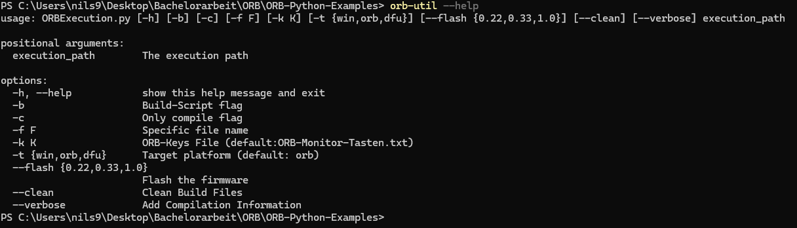

# Inhaltsverzeichnis
- [1. Einleitung](#1-einleitung)
- [2. Firmware-Architektur](#2-firmware-architektur)
    - [2.1 ORB-Firmware](#21-orb-firmware)
        - [2.1.1. Internals](#211-internals)
        - [2.1.2. API](#212-api)
        - [2.1.3. Python-Task](#213-python-task) 
    - [2.2. MicroPython-API (MP-API)](#22-micropython-api-mp-api)
        - [2.2.1. C/C++ Interfaces](#221-cc-interfaces)
        - [2.2.2. MicroPython-API](#222-micropython-api)
    - [2.3. MicroPython-Virtual-Machine (MP-VM)](#23-micropython-virtual-machine-mp-vm)
        - [2.3.1. MicroPython-Modules](#231-micropython-modules)
        - [2.3.2. MP-VM](#232-mp-vm)
- [3. Aufsetzen des GitHub-Projekts](#3-aufsetzen-des-github-projekts)
- [4. MicroPython Modul Registrierung](#4-micropython-modul-registrierung)
    - [4.1. Registrieren eines Test-Moduls](#41-registrieren-eines-test-moduls)
    - [4.2. Compilieren und Ausführen einer MPY-Binär-Datei](#42-compilieren-und-ausführen-einer-mpy-binär-datei)
    - [4.3. ORB-Python-Module hinzufügen](#43-orb-python-module-hinzufügen)
        - [4.3.1. Klassen, Objekt und Funktionen ermitteln](#431-klassen-objekt-und-funktionen-ermitteln)
        - [4.3.2 Aufbauen der Module](#432-aufbauen-der-module)
        - [4.3.3. Code::Blocks und Mockups](#433-codeblocks-und-mockups)
- [5. Erstellen der Sphinx-Dokumentation](#5-erstellen-der-sphinx-dokumentation)
    - [5.1. Aufsetzen der Sphinx-Dokumentation](#51-aufsetzen-der-sphinx-dokumentation)
    - [5.2. Umfang der Dokumentation](#52-umfang-der-dokumentation)
- [6. Entwurf der MicroPython VM-Schnittstelle](#6-entwurf-der-micropython-vm-schnittstelle)
   - [6.1 Ausführung der VM in einem Thread](#61-ausführung-der-vm-in-einem-thread)
   - [6.2 MicroPython-Ausführung unterbrechen](#62-micropython-ausführung-unterbrechen)
- [7. User Program Compile-Script erster Entwurf](#7-user-program-compile-script-erster-entwurf)
- [8. Testen der Windowsumgebung](#8-testen-der-windowsumgebung)
- [9. Integration in ORB-Firmware](#9-integration-in-orb-firmware)
    - [9.1. Entwicklungs Gerüst](#91-entwicklungs-gerüst)
    - [9.2. Übertragung des Programmes](#92-übertragung-des-programmes)
    - [9.3. Umsetzen der Tatsächlichen Modul Funktionen](#93-umsetzen-der-tatsächlichen-modul-funktionen)
    - [9.4. Umsetzen der Python-Task](#94-umsetzen-der-python-task)
    - [9.5. Anbinden des ORB-Monitor](#95-anbinden-des-orb-monitor)
        - [9.5.1. Anpassen der Print-Funktion](#951-anpassen-der-print-funktion)
        - [9.5.2. Anpassen der Exception Ausgabe](#952-anpassen-der-exception-ausgabe)
        - [9.5.3. Handhabung von Hard-Faults](#953-handhabung-von-hard-faults)
        - [9.5.4. Zusätzliche Konfigurations-Flags](#954-zusätzliche-konfigurations-flags)
    - [9.6. Wiederherstellen der ORB-Funktionen](#96-wiederherstellen-der-orb-funktionen)
- [10. User Program Compile-Script vollständig Umgesetzt](#10-user-program-compile-script-vollständig-umgesetzt)
    - [10.1. Unterstützung für Hex-Compilierung](#101-unterstützung-für-hex-kompilierung)
    - [10.2. Multi-File-Pre-Compilation](#102-multi-file-pre-compilation)
    - [10.3. Binary-Data-Frame](#103-binary-data-frame)
- [11. Firmware-Test](#11-firmware-test)
- [12. ORB-Util](#12-orb-util)
- [13. Implizites Float, Int und String-Casten](#13-implizites-float-int-und-string-casten)
- [14. Zusätzliche Builtin-Funktionen](#14-zusätzliche-builtin-funktionen)
    - [14.1 exit](#141-exit)
    - [14.2 getArg](#142-getarg)
- [15. Abschätzen des Speicherbedarfs](#15-abschätzen-des-speicherbedarfs)
    - [15.1 Überlegung zur Speicherbelegung](#151-überlegung-zur-speicherbelegung)
    - [15.2 Heap-Speicherzuweisung](#152-heap-speicherzuweisung)
    - [15.3 Maximale Programmlänge und Stack-Größe](#153-maximale-programmlänge-und-stack-größe)
- [16. Benchmark](#16-benchmark)
    - [16.1 Funktionsaufrufe](#161-funktionsaufrufe)
    - [16.2 Berechnungen](#162-berechnungen)
    - [16.3 Filter](#163-filter)
    - [16.4 Real World Examples](#164-real-world-examples)
        - [16.4.1 Line Follower](#1641-line-follower)
        - [16.4.2 Line Follower Smooth](#1642-line-follower-smoth)
        - [16.4.3 Forward-Backward](#1643-forwared-backward)

## 1. Einleitung
Der Implementierungsreport soll einen Überblick über die Schritte zur Umsetzung der ORB-Python-Firmware beschreiben. Also die Erweiterung der ORB-Firmware um die MicroPython-Byte-Code-Interpreter. Zunächst wird auf die Firmware-Architektur eingegangen. Dies soll die einzelnen Komponenten des Projektes kurz auflisten und ihre Aufgaben darstellen. Die Darstellung soll in Bezug zu dem vollständigen Projekt geschehen.

## 2. Firmware-Architektur
Im Folgenden wird kurz die Firmware-Architektur beschrieben. Hier anzumerken ist, dass wie in den Anforderungen beschrieben, auch unter Windows kompiliert und getestet werden soll. Die ORB-Firmware-System-Komponente wird unter Windows durch Platzhalter-Klassen, hier "Mockups" und Threads ersetzt. Durch diese Platzhalter werden die gleichen Schnittstellen wie durch die ORB-Firmware bereitgestellt.

Es gibt einige für diese Arbeit relevanten System-Komponenten. Im Wesentlichen lassen sich diese auf folgende Bestandteile eingrenzen. Die grün hinterlegten System-Komponenten sind Bestandteil der ursprüngelichen ORB-Firmware. Diese wurden gegebenenfalls erweitert oder angepasst, jedoch nicht gänzilich neu hinzugefügt. Die blau hinterlegten System-Komponenten sind solche, die durch das Anbinden der MicroPython-Virutal-Machine (MP-VM) angebunden und neu erstellt wurden.

  

*Abbildung 1: Firmware-Architektur*


Die für dieses Projekt relevanten System-Komponenten lassen sich in 3 Hauptteile unterteilen. Diese sind die ORB-Firmware , MicroPython-API (MP-API) und die MicroPython-Virtual-Machine (MP-VM). 

- #### 2.1 ORB-Firmware   
    - #### 2.1.1. Internals         
        Die ORB-Firmware wird zum größten Teil bereits bereitgestellt. Sie enthält alle Funktionalitäten, die mit dem ORB umgesetzt werden sollen. Dazu gehört das Anbieten von RTOS-Tasks und Funktionen welche für die Programmierung des Roboters verwendet werden. Außerdem gibt es ein User-Interface, so wie Bluetooth und USB-Schnittstellen. Desweiteren wird durch die ORB-Firmware eine Verbindung zu dem ORB-Monitor bereitstellt. Der ORB-Monitor ist ein Entwicklungs-Tool. Dieses wird für die Programmübertragung und zur Kommunikation mit dem Roboter verwendet. Die MicroPython-VM soll die hier genannten Funktionalitäten verwenden und in diese integriert werden.

    - #### 2.1.2. API
        Für die Programmierung unter C++ stellt die ORB-Firmware bereits eine API-Klasse bereit, die `ORB-Local.h`. Die MicroPython-VM soll, wie in den Anforderungen beschrieben, diese Funktionen auch zur Verfügung stellen. Für diesen Zweck wird die die AppTask als Interface-Klasse verwendet. Diese bietet die gleichen Funktionen wie die `orb_local.h` an. Die umgesetzen Module der MicroPython-VM rufen im wesentlichen die dort definierten Funktionen auf. 

    - #### 2.1.3. Python-Task
        Der MicroPython-Interpreter soll in sich geschlossen als Teil der ORB-Firmware ausgeführt werden. Dazu soll eine MicroPython-RTOS-Task implementiert werden, im Folgenden auch Python-Task genannt. Diese verwendet durch die MP-API bereitgestellte Funktionen. Die Python-Task soll die VM starten, stoppen und diese allgemein verwalten. Zu diesem Zweck werden auch Funktionen zur Status-Abfrage der MP-VM implementiert. Die Python-Task wird mit dem User-Interface verbunden. Diese soll genauso wie die App-Task verwendet werden können.

- #### 2.2. MicroPython-API (MP-API)

    - #### 2.2.1. C/C++ Interfaces
        Da die MP-VM ein C-Projekt ist und die ORB-Firmware C++-Funktionen anbietet, ist es wichtig, das C++- nach C-Interfaces bereitgestellt werden.  Die Interfaces werden in den meisten Fällen nur einen Aufruf der C++-Funktion innerhalb einer C-Funktion darstellen. In manchen fällen müssen umfangreichere änderungen vorgenommen werden.

    - #### 2.2.2. MicroPython-API
        Die MP-API ist die Schnittstelle zu der MP-VM, hier werden Funktionen für die Python-Task bereitgestellt. Diese sollen das Einbinden in die ORB-Firmware erleichtern und klar strukturieren. Wie bereits in [2.1.3. Python-Task](#213-python-task) beschrieben, werden hier Funktionen zur Verwaltung der Python-Task bereitgestellt.

- #### 2.3. MicroPython-Vitrual-Machine (MP-VM)  
    Die MicroPython-Vitrual-Machine (MP-VM) ist der MicroPython-Byte-Code-Interpreter. Dieser führt MicroPython-Byte-Code aus. Alle durch MicroPython verwendbaren Module müssen für diese definiert und registriert werden.  

    - #### 2.3.1. MicroPython-Modules
        Im Wesentlichen werden hier die MicroPython-Module umgesetzt. Diese definieren mit welchen Objekten, Funktionen, etc. das ORB programmiert werden kann. In diesem Schritt werden die C-Interface-Klassen an die MP-VM angebunden. Diese Module sind Abbildungen der ORB-Funktionen und keine genaue Kopie. Funktional sollen sie jedoch die gleichen Konzepte abbilden.

    - #### 2.3.2. MP-VM
        Die MP-VM wird durch das MicroPython-Projekt bereitgestellt. Die MP-VM wird für den Anwendungsfall dieses Projektes konfiguriert, angepasst und durch Funktionen, welche für die Umsetzung dieses Projektes benötigt werden, erweitert.

Wie die genauen Anforderungen an die umzusetzenden Funktionen aussehen, sowie in welchem Maße die ORB-Firmware durch die MP-VM erweitert werden soll, ist dem ['Anforderungen'-Dokument](./Anforderungen.md) zu entnehmen. Auf welche Art und Weise diese Ziele erfüllt wurden, wird im Folgenden beschrieben.

## 3. Aufsetzen des GitHub-Projekts

1. **Repository erstellen**:  
    - Zunächst musste ein neues Repository auf GitHub angelegt werden. Es wurde eine [`README.md`](./../README.md) erstellt.   
    Diese ReadeMe-Datei soll Anweisungen zu der Verwendug bzw. Einrichtung dieses Projektes enthalten und im Laufe des Projektes erweitert werden. 

2. **Fork des MicroPython-Projekts erstellen**:  
    - Der erste Schritt hier war es einen Fork des MicroPython-Projektes zu erstellen.  
    Durch diesen Schritt ist es einfacher nachzuvollziehen, an welchen Stellen Änderungen in dem MicroPython-Projekt vorgenommen wurden.
    
> [!NOTE]  
> Der Embed-Port des Projektes wird gegen den Embed-Port im MicroPython-Projekt gebaut, d.h. Änderungen an dem Code von MicroPython wie z.b. Änderungen an der `vm.c` (wie z.B. [MicroPython-Ausführung unterbrechen](#42-micropython-ausführung-unterbrechen)) werden in diesem Fork gemacht.
//TODO link

3. **MicroPython als Submodul hinzufügen**:  
    - Dadurch das ein Fork des MicroPython-Projektes erstellt wurde, konnte dieses als Submodul in das GitHub-Projekt integriert werden. Dazu wurde folgender Befehl ausgeführt:
        ```bash
        git submodule add https://github.com/NiHoffmann/micropython micropython
        ```
        Durch die Submodul-Struktur ergibt sich eine klare Trennung der verschiedenen Komponenten dieses Projektes. Auch alle anderen Git-Repositories die im Laufe des Projektes eingebunden wurden, werden als Submodul bereitgestellt. Dies soll auch späteren Entwicklern die Möglichkeit geben, dieses Projekt bei Änderungen, Bug-Fixes, usw. diese möglichst einfach wieder in das ORB-Python Projekt einzubinden.

4. **MicroPython-Projekt einrichten**:  
    - Anschließend musste der MPY-Cross-Compiler gebaut werden. Dieser wird verwendet um Python-Programme zu MPY-Byte-Code zu kompilieren. Der MPY-Byte-Code ist das Daten-Format, welches von der MicroPython-VM gelesen und verarbeitet werden kann. Dafür wird in dem Verzeichnis [`micropython\mpy-cross`](./../../../../micropython/tree/master/mpy-cross) der Befehlt `make` ausgeführt.
    - Im Gegensatz zu anderen MicroPython-Ports hat der Embed-Port keine externen Abhängigkeiten. Daher musste dieser nicht weiter eingerichtet werden.

5. **Erste Projektkonfiguration mit MicroPython Embed**:    
    Für die Initialisierung des Projekts wurden erst einmal zwei Dateien aus dem MicroPython-Embed-Projekt verwendet:
    - [`micropython_embed.mk`](./../ORB-Python/libs/mp_embed/micropython_embed.mk): Diese Datei enthält die Make-Regeln für den Embed-Port.
    - [`mpconfigport.h`](./../ORB-Python/libs/mp_embed/mpconfigport.h): Diese Datei enthält die Konfiguration der MicroPython-Ports mehr dazu, in Konzepte, unter [MicroPython-Flags](./Konzepte.md#micropython-flags).
    - Diese beiden Dateien werden in dem Libs-Ordner unter [`ORB-Python\libs\mp_embed`](./../ORB-Python/libs/mp_embed/) abgelegt. Sie werden verwendet um dem MicroPython-Embed-Port zu bauen.

6. **Änderungen am geforkten MicroPython-Projekt**:   
    - Die [`mpconfigport_common.h`](./../../../../micropython/tree/master/ports/embed/port/mpconfigport_common.h)-Datei ist für den Build-Prozess vorgesehen und enthält Definitionen für z.B. die Speicherzuweisung. Unter Linux wird hier der Header `alloca.h` eingebunden. Da der äquivalente Windows-Header `malloc.h` fehlt, wurde eine If/Else-Anweisung hinzugefügt.  
        ```cpp
        #if defined(__FreeBSD__) || defined(__NetBSD__)
        #include <stdlib.h>
        #elif defined(_WIN32)
        #include <malloc.h>
        #else
        #include <alloca.h>
        #endif
        ```
        Dies ermöglicht das Bauen des MicroPython-Port unter Windows.

7. **Pfadanpassung in micropython_embed.mk**:  
    - In der Make-Datei [`micropython_embed.mk`](./../ORB-Python/libs/mp_embed/micropython_embed.mk) habe der Pfad für `MICROPYTHON_TOP` zu dem Relativen-Pfad meines MicroPython-Projektes angepasst:
        ```makefile
        MICROPYTHON_TOP = ../../../micropython
        ```

8. **Kompilieren des MicroPython-Projekts**:  
    - Anschließend konnte das MicroPython-Projekt vor-kompiliert werden. Dafür musste sichergestellt werden, dass alle notwendigen Werkzeuge wie Make, GCC und Python installiert sind. Die Kompilierung wurde mit folgendem Befehl gestartet:
        ```bash
        make -f .\micropython_embed.mk
        ```

9. **Einrichten des Code::Blocks-Projekts**:  
    - Anschließend wurde ein leeres C++-Projekt in Code::Blocks erstellt. Dieses wurde so konfiguriert, dass der GCC-Compiler verwendet wird.

10. **main.cpp erstellen und Suchverzeichnisse konfigurieren**:  
    - Um die Code::Blocks-Konfiguration zu vallidieren, wurde eine [`main.cpp`](./../ORB-Python/src/main.cpp)-Datei erstellt. Zusätzlich wurden die Suchverzeichnisse für den Compiler angepasst. Folgende Pfade mussten hinzugefüht wuerden:
        - `src/`
        - `libs/micropython_embed`
        - `libs/micropython_embed/port`  
        
    - Zusätzliche wurden die benötigten C-Dateien des MicroPython-Port zu dem Code::Blocks-Build-Prozess hinzugefügt. Dies sind alle von MicroPython im Vor-Kompilier-Prozess generierten Dateien. Weitere im Verlauf erstellte Dateien und Verzeichnisse müssen auch zu den Build-Dateien und Code::Blocks-Build-Prozess hinzugefügt werden.

11. **Compiler-Flags hinzufügen**:    
Um sicherzustellen, das MicroPython korrekt kompiliert und problemlos ausgeführt werden kann, ist es wichtig die richtigen Compiler-Flags zu setzen. Das MicroPython-Projekt stellt eine Vielzahl an Mikrocontroller-Ports bereit. Diese wurden betrachtet. Es konnte folgende Erkenntnis daraus gezogen werden. Die '-Og' und '-Os' Flags werden für MicroPython-Ports verwendet. Ansonsten wird das Kompilieren mit '-O0' als unproblematisch angesehen. Die '-O0'-Flag wird für die Optimierungsfreie-Kompilierung verwendet. Jedoch ist hier ein unter Windows auftretender Bug zu beachten, siehe [Windows-Bug: Falsches Register bei Non-Local Return-Adressierung](Konzepte.md#windows-bug-falsches-register-bei-non-local-return-adressierung). An dieser Stelle sind Kompatibilitätsüberlegungen der Compiler-Flags, unter Berücksichtigung der ORB-Firmware, zu machen. Im Konzept unter [Compiler Flag Kompatibilität](Konzepte.md#compiler-flag-kompatibilität) ist genauer erklärt, warum es als notwendig angesehen wird, nur diese Flags zu verwenden, falls Optimierung gewünscht oder notwendig ist.
      
12. **Code:Blocks Build Targets anpassen**:    
Zu diesem Zeitpunkt war der Build-Prozess in der Code:Blocks-Umgebung von dem des MP-Embed-Port losgelöst. Im besten Fall sollte aus der Code:Blocks-Umgebung auch der MP-Embed-Port gebaut werden können. Zu diesem Zweck wurden im Code::Blocks-Projekt 2 Build-Target angelegt : *Build* und *Rebuild*. Während Build der vorher konfigurierte Prozess ist, ist Rebuild erweitert durch einen Pre-Build-Step. Das *Rebuild*-Build-Target ruft ein Batch-Script auf welches die Kommandos für das 'Clean' und 'Build' des MicroPython-Embed-ports enthält. Die Verwendung des Targets ist wie folgt gedacht. Entwickelt man nur in der Code:Blocks-Umgebung ohne neue Module oder Funktionen hinzuzufügen, so reicht das Build-Target aus, da die MP-Embed-Port-Ressourcen nicht immer neu generiert werden müssen. Kommen nun neue Module hinzu, werden alte umbenannt oder neue Funktionen eingeführt. So kann man einmal das Rebuild-Target ausführen. Danach verwendet man wieder wie gewohnt Build.

## 4. MicroPython Modul Registrierung

### 4.1. Registrieren eines Test-Moduls

Als erstes Modul wurde ein Test-Modul umgesetzt. Dies war eine direkte Kopie des `examplemodule.c`, welche nicht weiter konfiguriert wurde. 

Um dieses mit dem Embed-Port dieses Projektes verwenden zu können, wurde in dem `src`-Verzeichnis ein Modul-Ordner erstellt. 
Es musste in dem MicroPython-Embed-Makefile ([`micropython_embed.mk`](./../ORB-Python/libs/mp_embed/micropython_embed.mk))
die `USER_C_MODULES`-Variable um den Pfad zu den Modul-Ordnern erweitert werden. 
Außerdem wurde in diesem Schritt direkt die C-Flag um die Includ-Directive ‚-I‘ für den Modul-Ordern erweitert.
Die Include-Pfade für Module sollen immer relativ zu diesem Ordner gesetzt sein, um die `USER_C_MODULES` nicht für jedes Modul erneut anpassen zu müssen.

Das durch MicroPython bereit gestellte Beispiel-Modul konnte problemlos eingebunden werden, wodurch validiert werden konnte, dass das Projekt an dieser Stelle korrekt konfiguriert wurde.

Zu diesem Zeitpunkt wurde jedoch noch der Klar-Text-Interpreter des MicroPython-Projektes verwendet.

### 4.2. Compilieren und Ausführen einer MPY-Binär-Datei

Im nächsten Schritt wurde der Byte-Code Interpreter getestet.
Dafür ist es wichtig das folgende Flags in der `mpconfigport.h` gesetzt sind:
```cpp
#define MICROPY_PERSISTENT_CODE_LOAD            (1)
#define MICROPY_ENABLE_GC                       (1)
#define MICROPY_PY_GC                           (1)
```

Wobei `MICROPY_PERSISTENT_CODE_LOAD` die Flag für das Verwenden des Byte-Code-Interpreters ist. Die anderen beiden Flags werden für den Garbage-Collector verwendet. Zu diesem hat der MicroPython-Embed-Port Abhängigkeiten und diese müssen für diesen Port immer eingestellt sein.
Nachdem dies konfiguriert war, konnte das Code::Blocks-Projekt erweitert werden. Zunächst wurde hier eine MPY-Datei in einem Byte-Array statisch gespeichert. Diese konnte dann an die MP-VM gegeben und ausgeführt werden. 

Durch diese Umsetzung war es möglich einen ersten Funktions-Test des Byte-Code-Interpreter durchzuführen. Nach dieser validiert werden konnte, war der nächste Schritt das Laden einer MPY-Datei durch das Windows-File-System. Nachdem auch dies umgesetzt war, war es möglich mit dem Aufruf 'mpy-cross program.py' MicroPython-Programe zu compilieren und die MPY-Datei von dem Code::Blocks-Projekt laden zulassen.

Die aus der Code::Blocks-Umgebung geladene Datei wird in dem Pfad `ORB-Python\program\program.mpy` erwartet. Dies hat sich bis zu dem Ende dieses Projektes nicht verändert. Jedoch wurde das Datei-Format der erwarteten Binär-Datei angepasst und auch erweitert. So wird bei dem aktuellen Stand eine `.bin`-Datei erwartet. Außerdem ist es möglich mithilfe verschiedener Start-Parametern MicroPython-Dateien aus anderen Ordnern auszuführen. Ein Beispiel wäre das Ausführen der Windows-Tests. Für diesen Zweck werden zwei Parameter unterstützt. Diese Parameter sind die Übergabe des Pfades zu der MPY-Datei und das Setzen einer Flag, welche bestimmt ob der MicroPython-Interpreter durch einen User-Interrupt unterbrochen werden soll.
```batch
ORB-Python.exe "path_to_bin/file.bin" "execute_with_interrupt"
```
Die genannte `.bin` Datei wird durch ein zusätzlich erstelltes Compile-Script realisiert. Die Implementierung des Compile-Scripts ist in zwei Kapitel unterteilt: [7. Compile-Script erster Entwurf](#7-user-program-compile-script-erster-entwurf) und [10. User-Program-Compile-Script vollständig umgesetzt](#10-user-program-compile-script-vollständig-umgesetzt).
Die gesamten Funktionalitäten des Compile-Prozesses wurden im Laufe des Projektes auf das Tool ['orb-util'](#orb-util) verlagert. Dieses bündelt die verschiedenen erstellen Scripts, welche für die Verwendung des ORB benötigt werden. Eben so wie solche, die für eine benutzerfreundliche Verwendung entstanden sind.

## 4.3. ORB-Python-Module hinzufügen

### 4.3.1. Klassen, Objekt und Funktionen ermitteln

Der erste Schritt für die Umsetzung der ORB-Python-Module, war es zu überlegen welche Module umgesetzt werden sollen. Wie den Anforderungen zu entnehmen ist, sollen alle Funktionen der `orblocal.h` in MicroPython abgebildet werden. Dazu gehört es nicht nur die Funktionen abzubilden, sondern auch zu überlegen, wie die Funktionen am besten in die "Python-Welt" übertragen werden können.
  
Hier ist es sinnvoll Funktionen in Klassen zu bündeln. Z.b. Motor-Funktionen in eine Motor-Klasse. Geräte, welche an das ORB angeschlossen werden, können in einem Modul 'devices' zusammengefasst werden. Alle anderen Funktionen könnten in einem gesonderten Modul wie z.b. die 'wait()'-Funktion eines 'time'-Moduls gebündelt werden.

Die genaue umgesetzte Strukturierung ist der [Python-Api: "sphinx-python-api.pdf"](sphinx-python-api.pdf) zu entnehmen. Ursprünglich war der Plan mit zusätzlichen Name-Spaces zu arbeiten bzw. allen Modulen einen 'orb.' Präfix zu geben. Dies würde verdeutlichen, dass es sich hier um die ORB-Implementationen handelt.
Davon musste jedoch absehen werden: siehe [Problematik bei der Verwendung von Namespaces](Konzepte.md#problematik-bei-der-verwendung-von-namespaces).

### 4.3.2 Aufbauen der Module

In diesem Schritt wurden die Module, Klassen, Objekte und Funktionen des MicroPython-Port erstellen. Abgeleitet werden diese wie bereits beschrieben aus der `orblocal.h`.
Der Modul-Design-Flow für MicroPython-Module hat sich als ein klarer Prozess herausgestellt. Dieses ist in dem folgenden Diagramm beschrieben.  

  

*Abbildung 2: Module Designflow*

Im Wesentlichen mussten hier Dictionaries für Module, Objekte, Konstanten und Funktionen anlegt werden. Diese werden verwendet, um C-Funktionen an einen MicroPython-Aufruf zu binden. Die Registrierung dieser Module verwendet für die Namen der Aufrufe im Python-Code QStrings. Durch die Natur der QStrings, musste nach dem Erstellen oder Umbenennen von Modulen oder Funktionen, der MicroPython-Embed-Port neu gebaut werden. Mehr dazu im Konzept unter [QString](./Konzepte.md#qstrings). Im Wesentlichen wird hier das C-Bindeglied zu dem MicroPython-Interpreter erstellt. Auch die MicroPython-C-Interface-Klassen bzw. deren Mockup-Varianten wurden in diesem Schritt erstellt. Mehr dazu und der Zweck der Mockup-Klassen im nächsten Kapitel [Code::Blocks und Mockups](#233-codeblocks-und-mockups).
Im Folgenden ein übersichtliches Beispiel-Modul, welches das Vorgehen bei der Entwicklung eines MicroPython-Moduls deutlich machen soll:  
```cpp
//include für die MicroPython Methoden und Objekt-Deffinitionen
#include "py/builtin.h"
#include "py/runtime.h"

//Erstellen einer C-Funktion, diese wird von dem MicroPython Interpreter Später aufgerufen
static mp_obj_t py_subsystem_info(void) {
    //Der Rückgabe wert von MicroPython Funktionen ist immer ein MicroPython-Objekt
    return MP_OBJ_NEW_SMALL_INT(42);
}
//Mocro um eine Funktion als MicroPython-Objekt zu registrieren
MP_DEFINE_CONST_FUN_OBJ_0(subsystem_info_obj, py_subsystem_info);

//Modul Dictionary
static const mp_rom_map_elem_t mp_module_subsystem_globals_table[] = {
    //Name des Moduls
    { MP_ROM_QSTR(MP_QSTR___name__), MP_ROM_QSTR(MP_QSTR_subsystem) },
    //QString mit wert `info` welches an der Funktions aufruf subsystem_info_obj gebunden wird.
    { MP_ROM_QSTR(MP_QSTR_info), MP_ROM_PTR(&subsystem_info_obj) },
};
//Macro um das Dictionary zu Registrieren bzw. zu einem MicroPython-Objekt zu konvertieren
static MP_DEFINE_CONST_DICT(mp_module_subsystem_globals, mp_module_subsystem_globals_table);

//Das hier ist unser MicroPython-Objekt für das Modul
const mp_obj_module_t mp_module_subsystem = {
    //Wir haben einen Objekt-Typ-Modul
    .base = { &mp_type_module },
    //Hier deffinieren wir den gloabls-table also die öffentlich verfügbaren Funktionen dieses Moduls
    .globals = (mp_obj_dict_t *)&mp_module_subsystem_globals,
};

//Hier ist die Tatsächliche Registrierung des Moduls, dieser Aufruf fügt das Modul in die MicroPython-Modul/Funktions Tabelle ein
MP_REGISTER_MODULE(MP_QSTR_subsystem, mp_module_subsystem);
```
[[vgl. MPD]](https://docs.micropython.org/en/latest/develop/library.html)   

Wie genau Module aufgebaut werden und die Registrierung aussieht, ist aus dem Konzept zu entnehmen. Unter dem Kapitel [MicroPython-Types](Konzepte.md/#micropython-types) findet sich ein guter Einstiegspunkt. Es finden sich noch weitere Kapitel, welche das interne Vorgehen des MicroPython-Interpreters erläutern. Hier wird auch genauer auf die Bausteine der Implementierung eingegangen. Diese sind weitestgehend innerhalb des genannten Kapitels verlinkt.

//wir sind hier

### 4.3.3. Code::Blocks und Mockups

Wie in [Warum den MicroPython Embed Port verwenden?](#warum-den-micropython-embed-port-verwenden) bereits beschrieben, soll der MicroPython Embed Port ohne die direkte Einbindung der ORB-Firmware kompiliert werden können. Zu diesem Zweck werden sogenannte "Mockups" eingeführt. Diese Mockups sind C-Dateien, welche die C-Interface-Methoden der ORB-Firmware simulieren. Die tatsächlichen Implementierungen werden später als Teil des ORB-Firmware-Projektes umgesetzt.

Das bedeutet, dass Mockups die gleichen Enums, Funktionen und Variablen enthalten. Welche später von der ORB-Firmware benötigt werden. Und die Funktionalitäten des ORB für die MicroPython-Umgebung bereitzustellen. Ein Beispiel könnte folgendermaßen aussehen:

Es gibt eine Motor-Mockup-Datei mit der folgenden Funktion:

```cpp
void setMotor(uint8_t port, uint8_t mode, int16_t speed, int pos) {
    printf("set motor port(%u) mode(%u) speed(%d) pos(%d)\n", port, mode, speed, pos);
}
```

Das Motor-Modul kann dann diese Mockup-Funktion verwenden:
```cpp
static mp_obj_t set(size_t n_args, const mp_obj_t *pos_args, mp_map_t *kw_args) {
    enum { ARG_mode, ARG_speed, ARG_position };

    static const mp_arg_t allowed_args[] = {
        { MP_QSTR_mode, MP_ARG_REQUIRED | MP_ARG_KW_ONLY | MP_ARG_INT, {.u_int = 0 } },
        { MP_QSTR_speed, MP_ARG_KW_ONLY | MP_ARG_INT, {.u_int = 0 } },
        { MP_QSTR_position, MP_ARG_KW_ONLY | MP_ARG_INT, {.u_int = 0 } },
    };

    mp_arg_val_t args[MP_ARRAY_SIZE(allowed_args)];
    mp_arg_parse_all(n_args - 1, pos_args + 1, kw_args, MP_ARRAY_SIZE(allowed_args), allowed_args, args);

    motor_obj_t *self = MP_OBJ_TO_PTR(pos_args[0]);

    //use the mockup funktion 
    setMotor(self->port, args[ARG_mode].u_int, args[ARG_speed].u_int * self->direction, args[ARG_position].u_int * self->direction);


    return MP_OBJ_FROM_PTR(self);
}
static MP_DEFINE_CONST_FUN_OBJ_KW(set_obj, 1, set);
```

Im Gegensatz dazu wird die ORB-Firmware anstelle der Mockup-Datei eine andere Motor-Implementations-Datei einbinden. Für beide Dateien sind Methoden Namen und Parameter gleich. Und bietet somit ein C-Interface für die C++ Funktionen der ORB-Firmware. Dieser Schritt wird über einen unterschiedlichen Include-Ordner für die Interface-Dateien realisiert. Die Struktur innerhalb der Includ-Ordner ist gleich.

## 5. Erstellen der Sphinx-Dokumentation
Im nächsten Schritt wurde die Sphinx-Dokumentation erstellt. Diese enthält Informationen über die Python-API. Also welche Funktionen aus der MP-VM erreichbar sind.

### 5.1. Aufsetzen der Sphinx-Dokumentation
Um die Sphinx-Dokumentation einzurichten wurde an Anweisungen aus [https://www.sphinx-doc.org/en/master/usage/installation.html](#https://www.sphinx-doc.org/en/master/usage/installation.html) gefolgt. Alle weiteren relevanten Informationen lassen sich ebenfalls in der [Sphinx-Dokumentation](#https://www.sphinx-doc.org/en/master/index.html) finden. Dort findet sich auch die Syntax zur erstellung der Dokumentation. Da Sphinx nicht direkt gegenstand dieser Bachelorarbeit ist, soll auf diese nicht weiter eingeganen werden. Die Sphinx-Tools wurden mithilfe von [Chocolatey](#https://chocolatey.org/) installiert. Als Grundgerüst der Dokumentation wuder  mit `sphinx-quickstart docs` ein Documentations-Layout generiert. Durch Sphinx ist es möglich die Dokumentation als HTML-Seite anzubieten. Diese kann unter : `Dokumentation/sphinx-docs/build/html/index.html` aufgeruft werden. Dadurch das Sphinx es auch erlaubt die Dokumentation zu Latex zu convertieren wird auch eine Dokumentations-PDF zur verfügung gesetllt. 
Mithilfe der Datei `Dokumentation\sphinx-docs\make.bat` können sowohl die HTML-, als auch die Latex-Dokumentations generiert werden.
```batch
make.bat html
make.bat latex
```

### 5.2. Umfang der Dokumentation 
Die Vollständige Dokumentation umfasst alle Funktionen die in der MP-VM umgesetzt wurden. Es sind einfache Informations-Texte zu den einzelnen Modules verfasst worden. Es wurden, wie in den Anforderungen deffiniert die Python-API Dokumentiert.

  

*Abbildung 3: Python-API*

Eben so werden die Python-Vm-Schnittstellen-Funktionen Dokumentiert. Diese wurde im weiterer Verlauf des Projektes umgesetzt. Im nächsten Kapitel wird auf diese genauer eingeganen. Es sind die Funktionen welche von der ORB-Firmware verwendet werden um die MP-VM zu verwalten. 

## 6. Entwurf der MicroPython VM-Schnittstelle
Die Öffentliche Schnittstelle der Python-VM sehen wie folge aus:
```cpp
void run(LoadLengthFunction loadLength, LoadProgramFunction loadProgram);
bool isRunning();
void stopProgram();
int getExitStatus();
const char* getExitType();
```
Wie zu erkennen ist, werden die Start- und Stop-Funktionen umgesetzt. Zusätzlich gibt den Status der Ausführung, 'isRunning()'. Diese Funktionen sind die wichtigsten Funktionen der Schnittstelle und umfassen ihre grundlegenden Aufgaben. Diese werden von der ORB-Firmware zu der Verwaltung, des MicroPython-Interpreter verwendet.
Hier zu erkennen ist, dass es zusätzlich Funktionen für den Exit-Type und Exit-Status gibt. Der Exit Status ist
aktuellen Exit-Status-Code der VM. Also ein wert aus einem Enmum, welcher für eine bestimmte Art der VM-Beendung steht. Die Werte des Exit-Status werden in der Config-Port-Header-Datei definiert. Der Exit-Type ist eine Zeichenkette, welche weiteren Informationen über der Art der VM-Beendung hält. Führt das Ausführen der MP-VM zu einer Exception so wird hier die Art der Exception ausgegeben. Bei einem Import welcher nicht aufgelöst werden konnte, ist der zurück gegebene wert 'Import Error'. Und dem Zurück gegebene Exit-Status "1". Während der Exit-Status für alle Exceptions gleich ist, kann der Exit-Type variieren.
```cpp
//Rückgabe wert einer Normale ausführung, Programm ist zu ende.
#define ORB_EXIT_NORMAL                         (0)
//Es wurde eine Exception von dem Code geworfen und nicht gehandelt.
#define ORB_EXIT_EXCEPTION                      (1)
//Es wurder der User-Interrupt (Stop-Button) verwendet.
#define ORB_EXIT_INTERRUPT                      (2)
```
Eine weitere Besonderheit ist die Art und Weise wie die 'run' Funktion aufgerufen wird. Da dieses Interface sowohl von der Windows-Umgebung, als auch Firmware-Umgebung verwendet wird. Musste hier das Umsetzen des Programm-Byte-Code-Ladens, von der VM-Schnittstelle gelöst werden. Dazu wurden die folgenden Funktionen als Parameter für die 'run'-Funktion definiert und aus der VM-Schnittstelle herausgezogen:
```cpp
typedef uint8_t* LoadProgramFunction(int length);
typedef uint32_t LoadLengthFunction();
```
Im Falle der Code::Blocks umgebung sind diese Funktionen in der `main.c` deffiniert und lädt den Programm-Code aus einer, durch ein Char-Array definierten Datei. Möchte man die Code::Blocks umgebung zum Testen verwendet muss dieser Pfad angepasst werden.
```cpp
char name[] = "program\\program.bin";
```
Die ORB-Firmware soll diese Funktionalitäten in der Python-Task umsetzen. Die Python-Task verwendet zugriffe auf den Flash-Speicher, um das Programm korrekt zu laden. Hier zu beachten ist das die VM-Schnittstelle in beiden Fällen ein durch malloc erzeugtes Byte-Array als Rückgabewert der Loadprogramm-Funktion erwartet. Die 'free' Funktion wird intern durch die 'run'-funktion aufgerufen.

### 6.1. Ausführung der VM in einem Thread

Um die oben genannten Funktionen Testen zu können war, es notwendig MicroPython Parallel zu andere Programm Logik ausführen zu können. Für diesen Zweck wurde in der Code::Blocks-Umgebung das Ausführen der MicroPython-VM in einem separaten Thread gestartet. Dadurch konnte diese Funktionen genauer untersucht werden. Grade für das Stoppen der Programmausführung. Wie genau dies Realisiert ist, wird in dem folgenden Kapitel [6.2. MicroPython-Ausführung unterbrechen](#62-micropython-ausführung-unterbrechen) beschrieben.

### 6.2. MicroPython-Ausführung unterbrechen

Für das Anbinden des Python-VM, muss es eine Möglichkeit geben dies VM-Ausführung durch die ORB-Firmware zu unterbrechen. Grade für den Fall das ein Nutzer-Programm in einer Endlos-Schleife hängen bleibt.
Betrachtungen wir bereits umgesetzte Systeme des MicroPython-Projektes, wie z.B. den Microbit-MicroPython-Port können wir folgende Erkenntnis ziehen. Die meisten bereits bestehende Systeme setzen einfach den gesamten Mikrocontroller zurück, um die Programm-Ausführung zu stoppen. Dies ist für einen Mikrocontroller, der nur Microypthon ausführt eine gute Lösung. Für diesen Anwendungsfall jedoch eher unpassend.

Microbit:
```cpp
static mp_obj_t microbit_reset_(void) {
    NVIC_SystemReset();
    return mp_const_none;
}
MP_DEFINE_CONST_FUN_OBJ_0(microbit_reset_obj, microbit_reset_);
```
oder auch Zephyr:  
```cpp
static mp_obj_t machine_reset(void) {
    sys_reboot(SYS_REBOOT_COLD);
    // Won't get here, Zephyr has infiniloop on its side
    return mp_const_none;
}
MP_DEFINE_CONST_FUN_OBJ_0(machine_reset_obj, machine_reset);
```
Da die MP-VM für diese MicroPython-Implementierung, durch einen separaten Task realisiert wird. Sollte nicht der gesamten Microcontroller bei einem Programm-Stop zurückgesetzt werden. Hier muss eine alternative Lösung gefunden werden.

Diese Beobachtung wurde durch das Betrachten von MicroPython-Community-Chats bestätigt: „You can reset the processor from within an ISR using pyd.hard_reset() or machine.reset(). Otherwise, you'd need to set a flag and have the main script exit when it detects that flag is set.“ [[MPC]](https://forum.micropython.org/viewtopic.php?t=2521#p14831)  
  
Die vorgeschlagene Lösung hier besteht darin, ein neues Flag einzuführen. Dies ist mit den in [Thread Safety](Konzepte.md#thread-safety) beschriebenen bedenken zu vereinbar. Die Überprüfung dieser Flag wurde in die Datei 'vm.c', am Anfang der 'dispatch_loop' aufgenommen. Diese Schleife ist in diesem Fall die Logik, welche bestimmt, wie eine Byte-Code-Anweisung verarbeitet werden soll.

Dabei sollte sich der MicroPython-Interpreter genauso wie bei einer vom Programm-Code erzeugten Exception verhalten, welche nicht durch einen 'catch'-Block abgefangen wird.
Dies soll dazu führt, dass die MicroPython-VM in einem Gültigen bzw. ihr gekannten Zustand beendet wird. Und dadurch gewährt leisten, dass die MicroPython-VM auch nach dem Stoppen problemlos neu gestartet werden kann.

Die Implementierung dieses Prozesses sieht wie Folgt aus:
Von außerhalb der VM muss im Falle eines Interrupts also ein Flag, hier 'orb_interrupt', gesetzt werden: 
```cpp
<...>
dispatch_loop:
       //This is the Main Logic, orb_interrupt will only ever be written from outside mp
       //so this flag is never a race condition, although we might finish one more "cycle" of micropython
       //execution but that is fine.
       //inside here we create the exception so we never get mem error
       //we have to do this at the top to bypass controll flow
       #ifdef ORB_ENABLE_INTERRUPT
       //Überprüfen ob wir einen Interrupt haben
       if(MP_STATE_VM(orb_interrupt)){
           //custom exception Object anlegen
           static mp_obj_exception_t system_exit;
           system_exit.base.type = &mp_type_SystemExit;
           //da es sich um einen User-Interrupt handelt bleibt der Stack-Trace leer
           system_exit.traceback_alloc = 0;
           system_exit.traceback_data = NULL;
   
           //Wir übergeben nur eine Argument zusammen mit unserere Exception den Namen der Exception "User Interrupt"
           system_exit.args = (mp_obj_tuple_t*) mp_obj_new_tuple(1, NULL);
           mp_obj_t mp_str = mp_obj_new_str("User Interrupt", 14);
           system_exit.args->items[0] = mp_str;
           //wir setzen die MicroPython State auf unsere erstellte Exception
           MP_STATE_THREAD(mp_pending_exception) = &system_exit;
           //diese zweite flag soll race-condiditons vermeiden, da es einen zweiten teil der user-interrupt logic gibt.
           MP_STATE_VM(orb_interrupt_injected) = true;
       }
       #endif

<...>
```
[[MP, 'micropython/py/vm.c', ab Zeile 309]](./../../../../micropython/tree/master/py/vm.c#L309)


Es ist wichtig zu beachten, dass dieses Flag nicht von innerhalb des MicroPython-Projekts beschrieben wird, auch nicht zum Zurücksetzen des Flags.   

//TODO ohne klammer formulieren  
Dieser Code plant eine einfache Exception. Der Nachteile hier ist, dass dies (mit einem unveränderten MicroPython) von einem Try-Catch-Block erfasst wird.   
  
Somit musste hier noch eine weitere Änderung vornehmen werden. Und den folgenden Teil der VM ändern. Dies ignoriert Try-Catch-Logik, falls das Interrupt-Flag gesetzt ist:
```cpp
<...>
//Diese abfarage Prüft wie die Tiefe der Exception sich zu der Tiefe der gehandelten Exceptions verhält.  
if (exc_sp >= exc_stack
    //this part of the code handles try/catch blocks, we dont want them to be treated as such, if orb interrupts treat any error as un-handled
    #ifdef ORB_ENABLE_INTERRUPT
    && !MP_STATE_VM(orb_interrupt_injected)
    #endif
    ) {
    // catch exception and pass to byte code
) {
<...>
```
[[MP, 'micropython/py/vm.c', ab Zeile 1473]](./../../../../micropython/tree/master/py/vm.c#1473)


Nun kann der VM-Interrupt geplant werden. Da die Dispatch-Schleife jedes Mal besucht wird, wenn eine Anweisung verarbeitet werden soll. Dies hat zufolge, dass die Ausführung nach Abschluss der aktuellen Befehlsverarbeitung unterbrochen wird.

## 7. User Program Compile-Script erster Entwurf

Um den Compile-Prozess von Python nach MPY-Byte-Code zu vereinfachen. Und um diesen in Code::Blocks einzubinden, wurde ein Compile-Script erstellt. Dieses ist in Python geschrieben.  
Das Compile-Script hat folgende Aufgabe:
1. Aufrufen des MPY-Cross-Compilers und Compilieren des Codes.
2. Erfassen der Programm-Länge.
3. MPY-Byte-Code und Programm Länge in eine Datei schreiben.

Das Compile-Script nahm als Kommando-Zeilen-Argument den Namen und Pfad der zu compilierenden Datei. 
Es wird das Python 'tempfile' Modul verwendet. Dies ermöglicht das MicroPython-User-Programm in ein temporäres Verzeichnis zu schreiben. Dieses wird dort compiliert. Die daraus entstehende temporäre '.mpy'-Datei wird dann wieder ausgelesen und für die weitere Verarbeitung verwendet.
Der Hintergedanke hierzu ist wie Folgt:
  
1. MicroPython muss bei Ausführung auf dem ORB, über die Information der Programm-Länge verfügen. Die Programm-Länge seht dabei immer am Anfang der MPY-Datei. Die Programm-Länge wird in den ersten 4-Byte des Programm-Fash-Bereiches abgelegt. Mit dieser Information kann dann später das Programm korrekt auf dem Programm-Flash ausgelesen werden.
2. Für die Kompilierung sind mehrere Schritte notwendig. Der Compile-Prozess wird dadurch vereinfacht.
3. Durch das Erstellen des temporären Ordners, entsthen keine zusätzlichen Dateien welche später wieder gelöscht werden müssen. Der Nutzer sieht nur die für ihn relevanten Dateien in seinem Projekt-Ordner.

Auch wenn es unter Windows bessere Wege gibt, als die Länge des Programmes immer mit vor die Datei zu schreiben. So ist dies eine Möglichkeit, dieses Prinzip auszuprobieren. Da es sich als eine sinnvolle Lösung für eine Später auftretendes Problem anbietet. Denn das ORB speichert das Programm in einem Flash-Bereich ohne vorher definierte Feste Länge. Vor dem Auslesen des MPY-Byte-Code muss klar sein, wie viel Byte aus dem Flash-Speicher ausgelesen werden sollen.

Im Späteren verlauf, wurde das User-Compile-Script erweitert. Es wurde im Wesentlichen ein neuer Data-Frame eingeführt. Außerdem wurde das Compilieren zu Intel-Hex erweitert. Diese Anpassungen finden sich unter [10. User Program Compile-Script vollständig Umgesetzt](#10-user-program-compile-script-vollständig-umgesetzt) und sind eine direkte Folge aus der Anbindung an den ORB-Monitor. Und Erweiterungen zur Unterstützung von mehr als einem User-Python-Script. Diese Änderungen machen jedoch erst im Kontext der ORB-Firmware Sinn. Werden daher, zum jetzigen Zeitpunkt, nicht genauer erklärt.

## 8. Testen der Windowsumgebung

Nachdem nun die Implementierung unter Windows, abgesehen von Verbesserungen und Bugfixes abgeschlossen war. Musste als Nächstes die Windows-Anwendung getestet werden. Dies war ein einfacher Funktions-Test um zu Validieren, das alle ORB-Funktionen korrekt auf Python abgebildet wurde. Das genaue Vorgehen des Testes ist in der Datei [Tests,Spezificationen.md](./Tests,Spezificationen.md) unter [Testen in der Code::Blocks Umgebung](./Tests,Spezificationen.md#1-testen-in-der-codeblocks-umgebung) nachzulesen.

## 9. Integration in ORB-Firmware

### 9.1. Entwicklungs Gerüst
Der erste Schritt meiner Entwicklung auf dem STM32-F405-Mikrocontroller bestand darin, das grundlegende Entwicklungsgerüst zu erstellen. Dabei ging es zunächst darum, die grundlegende Funktion des MicroPython-Ports zu testen. An diesem Punkt war es noch nicht entscheidend, Programme zu übertragen oder tatsächliche Funktionen zu nutzen.

Zunächst wurde die MicroPython-VM in das ORB-Firmware-Projekt integriert und leere C-Interfaceklassen für die Firmware erstellt. Der auszuführende Byte-Code wurde dabei als statisches Array in die Firmware integriert und gemeinsam mit ihr übertragen. Das erste Test-Programm war ein einfacher Funktions-Aufruf, welcher seitens der C-Interfaceklassen eine LED eingeschaltet hat. In diesem Schritt wurden die eigentliche ORB-Firmware zunächst außen vor gelassen. Das bedeutet, dass alle Tasks und zusätzlichen Funktionen, der ORB-Firmware , auskommentiert wurden. Lediglich die eingebundene EMB-Sys-Lib der ORB-Firmware wurde verwendet. Um auf dessen LED-Klassen zugreifen zu können.

Nun musste die Firmware auf den Mikrocontroller geflasht werden. Dazu wurde das Tool 'dfu-util' verwendet. Hierzu muss den Mikrocontroller zunächst in den DFU-Modus, versetzen werden. Zusätzliche wurde dieses mithilfe des Tools 'Zadig' als ein WinUSB-Gerät konfigurieren. Um die Verwendung von 'dfu-util' zu ermöglichen.

Nachdem diese vorbereitenden Schritte abgeschlossen wurden, konnte mit der eigentlichen Entwicklung des Embed-Ports begonnen werden. Um diesen schrittweise in die ORB-Firmware integrieren.

### 9.2. Übertragung des Programmes
Um die MicroPython-Funktionen testen zu können, war zunächst die Programm-Übertragung auf die ORB-Firmware wichtig. Außerdem musste das Ausführen von Programmen direkt aus dem Flash-Speicher realisiert werden.
Dies würde die spätere Entwicklungszeit deutlich verkürzen und ermöglichen, effizienter zu testen.

Es wurde entschieden, Sektor 11 als Speicherort, für die ORB-Programm zu wählen. Dieser liegt weit entfernt von allen anderen genutzten Speicherblöcken, einschließlich des Firmware-Codes. 

Sektor 11 befindet sich an der Adresse 0x080E0000. dfu-util kann Byte-Daten an definierte Stellen schreiben. Die MPY-Binär-Datei kann mit dem folgenden Befehl übertragen werden:
```
dfu-util -a address_offset --dfuse-address 0x080E0000 -D <bin_pfad>
```
Die MPY-Binärdatei hatte zu diesem Zeitpunkt folgende Struktur: `<4byte_länge><xxbyte_ mpy-bytes>`. 
Im Späteren verlaufen wurde, dieser Daten-Frame erweitert [10.3. Binary-Data-Frame](#103-binary-data-frame).

Die Länge muss zusätzlich übertragen werden, um zu bestimmen, wie viele Bytes aus dem Flash-Speicher geladen werden müssen. Diese Längenangabe liegt an einer vordefinierten Speicheradresse (0x080E0000 - 0x080E0003). Die Kodierung dieses 32-Bit-Wertes erfolgt im Big-Endian-Format. Im Späteren verlauf meines Projectes wird diese Längen Addresse weiterhin verwendet, jedoch als länge des Daten-Frame. Dieser wurde für das Verwenden von mehreren Programm-Modulen erweitert, vergleichbar mit der 'Middleware' des C++-Projektes.

### 9.3. Umsetzen der Tatsächlichen Modul Funktionen
In diesem Schritt wurden die MicroPython-Module mit den tatsächlichen ORB-Funktionen verbunden. Im Wesentlichen ist dieser Schritt das Umsetzen der C-Interface-Implementationen. Für diesen Zweck werden die durch die AppTask bereit gestellten Funktionen verwendet. Dies sind die gleichen Funktionen welche an die 'orblocal.h' überreicht werden. Für diesen Schritt waren nicht sonderlich viele Änderungen vonnöten. Die Motor-, Sensor-, Servo- und Timer-Funktionen ließen sich durch das anbinden, von einfachen Funktions-Aufrufen realisieren. Wie etwa für die Funktionen des Time-Moduls.  
```cpp
extern "C" {
    uint32_t getTime(){
        return AppTask::getTime(nullptr);
    }

    void wait(uint32_t time){
        AppTask::wait(nullptr, time);
    }
}
```
Ein besonderes Vorgehen wurde hier nur bei den Memory- und Monitor-Funktionen benötigt. Für die Memory-Funktionen musste der verwendete Speicher-Block angepasst werden. Dies lag an der wachsenden Firmware-Größe. Ein Nutzer war in der Lage Speicher-Bereiche, die von der Firmware verwendet wurden, zu überschreiben. Aufgrund dessen wurde der von der AppTask verwendete Nutzer-Speicher-Block auf Sektor 10 verschoben. Die hat zur Folge, dass auch für das C++-Programm der Nutzer-Speicher an dieser Stelle liegt. Das Monitor-Interface musste eine Funktion bereitgestellt bekommen, welche von dem MicroPython-Modul aus aufgerufen werden kann. Da die setMonitorText-Funktion der AppTask eine va_list und Arguemnte erwartet, musste diese erweitert werden. Dieses Vorgehen erlaubt den einfachen Aufruf einer Print-Funktion. Ohne das Anpassungen an dem MicroPython-Modul vorgenommen werden muss.
```cpp
void print(BYTE line, const char *format, ...) {
    va_list args;
    va_start(args, format);

    AppTask::setMonitorText(nullptr, line, format, args);

    va_end(args);
}

void setMonitorText(BYTE line, const char *str, size_t len){
    line %= 4;
    print(line, "%.*s", len, str);
}
```

### 9.4. Umsetzen der Python-Task

Nachdem nun die ORB-Funktionen in die MP-VM eingebunden waren, wurde als Nächstes die Python-Task erstellt.
Die Python-Task wird von der RTOS::TASK abgeleitet und setzt dessen Funktionen um. Eine RTOS::TASK ist eine Schnittstelle, welche von dem RTOS des ORB verwendet werden kann. Das Registrieren der Task bei dem RTOS geschieht im Constructor der Task und musste hier nicht angepasst werden.
Das RTOS des ORB ruft, sofern die Task als laufend gesetzt ist die Update-Funktion parallel zu den anderen RTOS-Task aus. Außerdem werden 'start'- und 'stop'-Funktionen für diese bereitgestellt. Diese bereitgestellt Logik wurde verwendet, um die Python-Task zu realisieren. Im Wesentlichen verwende die Python-Task, die Start-, Stop-, und Update-Logik um die VM-Schnittstelle zu verwalten. Der Workflow der Python-Task wird durch die folgenden Funktionen realisiert:

1. PythonTask::Start( BYTE para )  
Der Erste Aufruf für die Python-Task ist immer der Start-Befehlt, hier wird die Python-Task gestartet. Nach diesem Funktions-Aufruf führt das RTOS die PythonTask::Upadte()-Funktion aus.
2. PythonTask::update()  
Die Update-Funktion einer RTOS-Task wird parallel zu den anderen Update-Funktionen der anderen Tasks ausgeführt. Im fall der Python-Task, initialisiert dieser Aufruft die MP-VM und führt den Python-User-Progamm-Code aus. Am Ende der Python-Task wird die RTOS::Task 'stop'-Funktion aufgerufen. Dies führt dazu das der Python-Code immer nur einmal ausgeführt wird. 
3. PythonTask::userInterrupt()  
Dieser Funktions-Aufruf wird verwendet, um die Python-Task zu unterbrechen. Die C++-Task verwendet die RTOS::stop-Funktion um die Ausführung zu unterbrechen. Im Gegensatz dazu wird in der Python-Task der Interrupt gescheduled. Dieser Interrupt unterbricht das Python-Programm durch eine Exception, wie in [4.2. MicroPython-Ausführung unterbrechen](#42-micropython-ausführung-unterbrechen) beschrieben. Die RTOS::update Funktion wird in jedem Fall bis zum Ende ausgeführt. Und darin inbegriffen die De-Initialisierung der Python-VM.

Entlang dieser 3 Funktionen werden Status-Falgs gesetzt, welche verwendet werden um die aktuellen Zusand der Python-Task auslesen zu können. Hierbei werden im Wesentlichen die VM-Schnittstellen-Status-Funktionen durch die Python-Task eingebunden. Jedoch werden diese auch leicht durch die Python-Task erweitert. Die ORB-Firmware soll immer nur mit den Funktionen der Python-Task arbeiten.

Zusätzlich wird in der PythonTask das Laden des Nutzer-Programmes realisiert. Im Wesentlichen sind dies nur Lese-Operationen auf dem Flash-Speicher der ORB.
```cpp
uint8_t* loadProgram(int length) {
    uint8_t* programData = (uint8_t*)malloc(length * sizeof(uint8_t));
    if (programData == nullptr) {
        return nullptr;
    }

    for( DWORD i=0;i<length;i++) {
        programData[i] = programMem.read(PROGRAM_LENGTH_BYTES + LANGUAGE_FLAG_BYTE + i);
    }
    return programData;
}

uint32_t loadProgramLength() {
    return (programMem.read(LANGUAGE_FLAG_BYTE + 0) << 24) |
           (programMem.read(LANGUAGE_FLAG_BYTE + 1) << 16) |
           (programMem.read(LANGUAGE_FLAG_BYTE + 2) << 8)  |
           (programMem.read(LANGUAGE_FLAG_BYTE + 3));
}
```
Dies sind konzeptionell die gleichen Funktionen, welche auch von der Windows-Application umgesetzt werden.

### 9.5. Anbinden des ORB-Monitor

Als Nächstes war es wichtig der ORB-Monitor mit der Python-Task zu verbinden. Dies ermöglicht das Testen von Text-Ausgaben. Also die Verwendung der 'setMonitor'- so wie 'print'-Funktion. Für diesen Zweck wurde die USB-Task wieder in die ORB-Firmware eingebaut. Im Wesentlichen musste hier keine größeren Änderungen vorgenohmen werden. Jedoch war es in diesem Schritt bereits Wichtig die Status-Informationen der VM-Schnittstelle, an die ORB-Firmware weiterzugeben. Dies hatte den Grund, das die Funktionen des ORB zurückgesetzt werden, solange keine AppTask läuft. Die bedeutet die ORB-Monitor ausgabe wird nicht Aktuallisiert bzw. Motoren etc. werden wieder zurückgesetzt, falls die URB-Task nicht weiß, dass ein User-Programm läuft. Im Wesentlichen musste hier das Verhalten der AppTask für die Python-Task nach gebaut werden. Dies gewährte jedoch direkt einen Einblick darein an welchen Stellen die ORB-Firmware für eine Funktional korrekte Python-Task angepasst werden musste.

### 9.5.1. Anpassen der Print-Funtkion

Nachdem dies umgesetzt war, ist das nächste Problem aufgefallen. Die ORB-Monitor Ausgabe geschieht über 4 Zeilen in einem Textfeld. Jede Zeile kann maximal 31-Zeichen enthalten. Aufgrund dessen musste die Print-Funktion der MP-VM angepasst werden. Der MicroPython-Embed-Port bietet einen einfachen Weg, Änderungen an der Funktionsweise der Print-Funktion vorzunehmen. In der Datei 'ORB-Python\libs\mp_embed\micropython_embed\port\mphalport.c' gibt es eine Funktion 'mp_hal_stdout_tx_strn_cooked' diese wird von dem Embed-Port für die Print-Funktion verwendet. Hier gibt es hier ein Problem, die Print-Funktion wird mit Einzelteilen des auszugebenden Strings aufgerufen. Auf dieses Problem wird in der Aussicht unter [Ausgabe von Print Anweisungen und Fehler-Meldungen](Evaluation.md#ausgabe-von-print-anweisungen-und-fehler-meldungen) weiter eingegangen. Jedes MicroPython-Print wird mit den Sonderzeichen '\r\n' abgeschlossen. Diese Eigenschaft konnten genutzt werden, um den String, auf dem ORB-Monitor auszugeben. Die String Bestandteile werden zwischen gespeichert. Wird in einem String das Zeichen '\r\n' erkannt, führt die 'mp_hal_stdout_tx_strn_cooked' Operationen durch. Diese geben Sinngemäß den String aus und bereiten die nächste Zeile der Ausgabe vor. Dies ermöglicht eine verhältnismäßig sinnvolle Ausgabe, auf dem ORB-Monitor.

### 9.5.2. Anpassen der Exception Ausgabe

Ein weiterer Stolper-Stein ist die Ausgabe von Exception. Diese sind oftmals zu groß um sie vollständig auf dem ORB-Monitor auszugeben. Daher wurde darauf beschränkt, nicht alle Informationen der Exception auszugeben. Es werden nur die nötigsten Informationen über eine Exception an den ORB-Monitor weiter gegeben. Namentlich den Exception-Typ und die Exception-Message. So sind zumindest die Meisten Exceptions sinnvoll auszugeben. Vor allem vom Nutzer erstellte Exceptions lassen sich so gut verwenden. Da diese den von Nutzer eingestellten Exception-Text weiterhin ausgibt. Der Stack-Trace wird nicht ausgegeben, da dieser die schwer darstellbare und am ehesten verzichtbaren Informationen enthält. Verwendet man MicroPython-Byte-Code, wird ohne hin die Zeile, in der der Fehler aufgetreten ist, nicht angegeben. Jedoch geht durch diese Entscheidung die Ausgabe der Funktion, welche zu dem Fehler geführt hat verloren.

### 9.5.3 Handhabung von Hard-Faults

Um einen zusätzlichen Schutzmechanismus in die ORB-Firmware bei Hard-Faults einzubauen. Wurden diese, um einen Fault-Handler erweitert. Die RTOS-Tasks stützen sich in ihrer Funktionsweise auf IRQ-Interrupt. Diese müssen unterbrochen werden, um die ORB-Tasks nicht parallel zu dem Hard-Fault-Handler-Code auszuführen. Dieser IRQ-Interrupt-Disable-Befehlt, ist atomar, also eine nicht kritische Operation:  
```cpp
__asm volatile ("cpsid i");
```
Die darauf folgenden Operationen sind, das setzten der GPIO-/Timer-Reset Register. Welche nur ein einfacher Zugriff auf eine vordefinierte Speicher-Adresse in dem Mikrocontroller-Funktion-Register sind.
Durch ihre Natur als Reset-Flags wird diesen Zugriff, als unproblematisch angesehen. Der aktuelle Zustand des Mikrocontrollers sollte für diese Operationen keine Rolle spielen. Dieses Vorgehen, soll bewirken das die angeschlossene Peripherie ausgeschaltet werden, bzw.
keine neuen Steuer-Befehle bekommen. Der gedankte hier ist das Schützen von z.B. Servomotoren welche durch ein fehlerhaftes Programm beschädigt werden können. Der Timer-Reset würde an dieser Stelle, das von ihnen genutzte PWM-Signal abstellen. Zusätzlich werden alle Status-LEDs des Boards nach dem Reset neu konfiguriert und angeschaltet. Dies Informiert den Nutzer, das es zu einem Hard-Fault gekommen ist.
Um diese Funktionalität auf eine sichere Art und Weise Testen zu können, kann man in seinem C++-Programm einen Null-Pointer dereferenzieren. Dies produziert einen Mem-Fault.

Dieser Zusatz ist eher für Fehler Erkennung und Handhabung in der Firmware gedacht, so wie ein Schutz-Mechanismus bei fehlerhafter Verwendung des Boards. Wie z.B. das Aufspielen der Flaschen Firmware-Version für die verwendete Hardware.
Am Ende des Fault-Handlers wird eine Endlos-Schleife ausgeführt. Eine weitere Funktion des Hard-Fault-Handler, ist der Umgang mit Fehlern welche nicht unbedingt durch den Nutzer entstanden sind, wie z.B. Flash-Korruption oder Fehler in der Firmware-Implementierung.

Eine umfangreichere Fault-Handle-Logik bring Risiken mit sich. Da das Programm-Verhalten, sobald ein Fault auftritt undefiniert ist.
Unter Berücksichtigung der oben genannten Punkte wird das Einführen von dieser Logik jedoch als sinnvoll eingestuft.

### 9.5.4 Zusätzliche Konfigurations-Flags

Wie in [2.2. Compilieren und Ausführen einer MPY-Binär-Datei](#22-compilieren-und-ausführen-einer-mpy-binär-datei) beschrieben, wird die mit der MP-VM zusammenhängenden Konfigurationen, in der 'mpconfigport.h'-Datei erwartet. Diese wird erweitert durch [`ORB-Python\src\python-vm\orb_config_port.h`](../ORB-Python/src/python-vm/orb_config_port.h). Die Platzierung der 'orb_config_port.h', in dem ORB-Python-Projektes, ist eine Designentscheidung. Die Konfiguration der MP-VM sollte Teil des ORB-Python-Projektes sein. Diese Datei einhält so wie vorher die 'mpconfigport.h' alle für die MP-VM benötigten Definitionen. Jedoch wurde diese, auch durch zusätzliche erweitert. So werden hier die verschiedenen Language-Flag gesetzt und Exit-Codes definiert. Die Language-Flag ermöglicht das Unterscheiden von C++ und Python-Programmen im Flash-Speicher. Im nächsten Kapitel, [7.5. Wiederherstellen der ORB-Funktionen](), wird dies genauer erklärt.
Außerdem ist  wichtig anzumerken das alle Änderungen in dem MicroPython-Projekt. Wie z.B. das Einführen der 'Exit()'-Funktion. Durch eine Definition an das Projekt angebunden werden.
```cpp
#if ORB_EXIT
{ MP_ROM_QSTR(MP_QSTR_exit), MP_ROM_PTR(&mp_exit_obj) },
#endif
```
Dies hat zwei Funktionen. Es wird der Design-Philosophie, des MicroPython-Projektes treu geblieben. Möchte man dies Firmware ohne ein bestimmtes Feature Kompilieren, etwa für Debug-Zwecke, so kann man es durch das Entfernen der Definition abwählen. In dieses Projekt ist aber ein weiterer Grund ausschlaggebend, für diese Entscheidung. Es sollte klar erkennbar sein, welche Änderungen an der MP-VM, zu welchem System-Teil gehören. Möchte man wissen wie z.B. die 'Exit()'-Funktion angebunden ist, so reicht es nach der Definition 'ORB_EXIT' zu suchen. Dies ist ein Versuch die Änderungen, an dem MicroPython-Projekt übersichtlich zu halten.

Es wurde das Projekt jedoch nicht nur um selbst erstellte Funktionen erweitert. Im Laufe der Firmware-Implementierung wurde die MP-VM um von MicroPython bereit gestellte Funktionen erweitert. Am wichtigsten sind hier das 'Math'-Modul, 'MIN'- und 'MAX'-Funktionen. So wie das implizite Verwenden des Daten-Typs 'Long', sobald ein Int-Overflow festgestellt wurde. Dies wurde in die Konfiguration aufgenommen, um einen MP-VM Absturz zu vermeiden. Bis zu diesem Zeitpunkt konnten nur 'Short Int' verwendet werden. Diese haben den Nachteil, das bei einem Overflow die MP-VM mit der Exception "Overflow Error" beendet wird. Dies ist durch die Natur der 'Short Int' als Nicht-Konkrete-MicroPython-Objekt. Da sie, wie in Konzepte beschrieben, ihren Daten-Wert in ihrem Pointer speichern. Sowie Typ-Bytes zusätzlich verwalten müssen. Bei einem Overflow könnte diese Besonderheit, zu einem Typ-Wechsel führen. Es gibt keine Mechanismen, um einen Overflow korrekt abzubilden. Der Daten-Typ 'Long' hingegen ist ein Konkretes-MicroPython-Objekt und verwaltet seinen Wert in einem zusätzlichen Daten-Feld. Somit hat man hier das Overflow-Veralten, welches man aus C/C++ kennt.
Um den Unterschied zwischen Nicht-Konkreten-MicroPython-Objektes und Konkreten-MicroPython-Objekten besser zu verstehen, finden sich in Konzepte unter [Wie funktioniert die Typ-Zuordnung (Non-Concrete-Types)](./Konzepte.md#wie-funktioniert-die-typ-zuordnung-non-concrete-types) und dem Folge-Kapitel, eine Erklärung.  
//TODO der Link stimmt zwar, ist aber nicht umbedingt das beste kapitel -- TODO Konzepte Concrete/Non-Concrete gegenüberstellen.

### 9.6. Wiederherstellen der ORB-Funktionen

Nun musste die Funktionalität der ORB-Firmware wieder hergestellt werden. Die Python-Task musste vollständig in das User-Interface integriert werden. Das User-Interface hat eine vielzahl an Funktionen um die AppTask zu verwalten. Diese mussten um das Verwalten der Python-Task erweitert werden. Wie z.B. die isAppActive()-Funktion.
```cpp
bool UserInterface::isAppActive()
{
  return( app.isRunning() || pythonTask.isRunning() || pythonTask.isStarting());
}
```
Hier anzumerken ist, das alle Funktionen des Unser-Interface namentlich angepasst wurden. Dies soll wieder spiegeln das jetzt auch die Python-Task verwaltet wird.
Die führt dazu das, alle Status abfragen die zuvor von der AppTask erwartet wurden, nun auch von der Python-Task beantwortet werden. Durch diese Entscheidung wurde das Einbinden der Python-Task zu einem gradlinigen Prozess.

Außerdem wurde die 'Remote'-Klasse angepasst. Diese wird für USB- und Bluetooth-Kommunikation verwended. Sie wurde erweiters, so dass sie Exceptions der MP-VM ausgibt. Dies ermöglicht es auch nach Programm-Beendigung, ohne großen aufwand die Fehlermeldungen der Python-Task anzuzeigen.

Jedoch gab es hier ein weiteres Problem zu lösen. Bis zu diesem Zeitpunkt wurde nur die Python-Task alleine in der ORB-Firmware ausgeführt. Jedoch muss es eine Möglichkeit geben sowohl C++- als auch Python-Programme auf das ORB zu übertragen und auszuführen. Es muss also für die ORB-Firmware eine Möglichkeit geben, zu erkennen welche Art Programm, zu einem gegebenen Zeitpunkt, im Programm-Flash der ORB liegt. Für diesen Zweck wurde eine Language-Flag eingeführt. Die Language-Flag ist eine 1-Byte Lange Flag. Diese befindet sich immer am Anfang des Nutzer-Programm-Speichers. Während der '0b00001111' dafür steht, das sich im Speicher ein Python-Programm befindet. Steht der Wert '0b1111000' dafür das ein C++-Programm vorhanden ist. Das User-Interface liest dieses Flag, bei einem gewünschten Programm-Start. Dadurch kann das User-Interface die Programmausführung entweder an die Python- oder App-Task weiter leiten.

Für diesen Zweck wurde das Binär-Format des Python-User-Programmes angepasst. Zusätzlich musste diese Information in der ORB-Application, dem C++-Programm vorhanden sein. Für diesen Zweck wurde das ORB-Application-Projekt, als Submodule, mit in das ORB-Projekt aufgenommen. Hier wurde ein zusätzliches Daten-Segement in der Linker-Datei der ORB-Application eingeführt:
```cpp
.flagSegment 0x080E0000:
{
    KEEP(*(.flagSection))
}
.startAppSegment 0x080E0004 : 
{
    KEEP(*(.startAppSection))
}
```
Das Beschreiben des 'flagSegementes' geschieht in der 'entry.cpp'-Datei:
```cpp
__attribute__((section(".flagSection"), used))
const uint8_t flag = 0b11110000;
```
Hier ist zu erkennen, das wir 1-Byte in die 'flagSection' schreiben, dieser Wert entspricht der C++-Language-Flag. Und kann durch das User-Interface erkannt werden.

Oben zu erkennen ist, das auch das 'startAppSegment' verschoben wurde. Dies wurde angepasst, da nun auch der C+++-Programm-Flash-Bereich auf Sektor 11 verschoben war. Eine direkte Folge aus den Änderungen, durch [7.2. Übertragung des Programmes](). Das StartAppSegment wird von der AppTask verwendet, um das C++-Programm auszuführen. Die Adresse des Segmentes wird auf eine Funktion gecastet. Diese wird für den Start des Nutzer-Programms ausgeführt:
```cpp
//*******************************************************************
#if (BOARD_MAIN == 00 && BOARD_SUB == 22)
 unsigned *addr = (unsigned*)0x80E0004;
#elif (BOARD_MAIN == 00 && BOARD_SUB == 30)
 unsigned *addr = (unsigned*)0x80E0004;
#elif (BOARD_MAIN == 01 && BOARD_SUB == 00)
 unsigned *addr = (unsigned*)0x80E0004;
#else
  #error "Board hardware version not defined"
#endif
  int (*func)(BYTE para, cORBlocal &ptr) =  (int (*)(BYTE, cORBlocal &))(*addr);
```
Wie hier zu sehen ist, wurde auch in der AppTask die Funktions-Adresse angepasst. Durch diese drei Änderungen war es möglich, die Programm-Unterscheidung zu realisieren. Nun konnte man sowohl Python- als auch C++-Programme von dem ORB ausfühen lassen.

## 10. User Program Compile-Script vollständig Umgesetzt
Wie bereits unter [7. User Program Compile-Script erster Entwurft](#7-user-program-compile-script-erster-entwurf) erwährt wurde das Compile-Script erweitert. 

### 10.1. Unterstützung für Hex-Compilierung

Für die Erweiterung der ORB-Firmware, wurde über den Zeitraum der Entwicklung der DFU-Prozess zum Aufspielen des User-Programms verwendet. Da die Firmware ohne hin öfter neu aufgespielt werden musste und das ORB somit schon im DFU-Modus war, hatte sich dies nicht als Hindernis geäußert.

Für ein Nutzerfreundliches verwendet der ORB ist es jedoch Essenziell, den ORB-Monitor als Entwicklungs-Tool im vollen Umfang nutzen zu können. Der ORB-Monitor erwartet eine Intel-Hex um das C++-Programm auf den ORB übertragen zu können. Dieser Prozess soll auch für Python-Programme genutzt werden. Für diesen Zweck wurde das Compile-Script erweitert. Glücklicherweise gibt es ein Python-Projekt [https://github.com/python-intelhex/intelhex](https://github.com/python-intelhex/intelhex) welches genau diese Aufgabe erfüllt. Dieses wurde zu Teilen in das Compile-Script hinzugefügt. Im Wesentlichen hat dies den Compilier-Prozess nicht verändert, sondern nur erweitert. Die im Vorfeld generierte '.bin'-Datei bleibt erhalten. Diese '.bin'-Datei wird weiterhin unter Windows verwendet. Zusätzlich wird diese Binär-Datei zu einem Intel-Hex umgewandelt. Die daraus Resultierende Datei hat das Kürzel '.hex'.

### 10.2. Multi-File-Pre-Compilation
Eine weitere gewünschte Änderung, ist das Zulassen von mehr als einem User-Script auf dem ORB. Dies erlaubt das erstellen und einbinden von Middleware. Somit würden sich Python-Script konzeptionell wie die C++-Application aufbauen lassen. Zudem hat der Nutzer eine bessere Möglichkeit sein Python-Projekt zu strukturieren.

Wie bereits in [7.2. Übertragung des Programmes]() und [2.2. Compilieren und Ausführen einer MPY-Binär-Datei]()
beschrieben wurde das Binär-Dateiformat in diesem Schritt weiter angepasst.

Dem Nutzer wird die Möglichkeit gegeben eine '.build'-Datei anzulegen. Des gibt zwei Felder, 'import' und 'main'. Eine solche Datei könnte wie Folge aussehen:
```cpp
{
    "import": ["middleware/dep.py", "middleware/dep2.py"],
    "main": "test.py"
}
```
Die in 'import' Aufgelisteten Dateien werden automatisch, der Reihe nach importiert und sind so für den Nutzer direkt verwendbar.
Hier zu anzumerken das kein File-System umgesetzt wurde. Dieser Prozess erlaubt es nicht, in dem Python-Script ein Import-Statement zu verwenden. Jedoch wird der vollständige Inhalt der Dateien in anderen Script, durch das automatische Laden zu Laufzeit, erreichbar. Imports können dabei von anderen Imports abhängig sein. Wobei dir Reihenfolge des Importierens zu beachten ist. Die 'main'-Datei ist der Einstiegs-Prunkt des Programmes und wird nach dem Import aller anderen Dateien ausgeführt.

Um dies umzusetzen, werden mehrere Binär-Dateien einzeln kompiliert und mit den nötigen Informationen zu einer Binär-Datei zusammen gefasst. Diese kann dann als ein Programm auf das ORB übertragen werden.
Sowohl die Windows-Anwendung als auch die ORB-Firmware können das angepasste Format verarbeiten.
Die Multi-File-Pre-Kompilation, sowie Programm Ausführung kann über das [ORB-Util](#orb-util)-Tool durchgeführt werden. Für die Ausführung, unter Windows, sieht der Befehlt wie folgt aus:  
```batch
orb-util -b -t win
```
Dies war die letzte Änderung an dem Binär-Format. Wie der vollständige Daten-Frame aussieht, wird im Folgenden beschrieben.

### 10.3. Binary-Data-Frame

Wie bereits in den Vorherigen Kapitel erwähnt ist der Binary-Data-Frame eine Entwicklung durchlaufen. Dieser wurde von seiner anfänglichen Form:
```html
<Bytes(4)        MPY-Size>
<Bytes(MPY-Size) MPY-Data>
```
Durch zusätzliche Anforderungen an die ORB-Firmware erweitert und angepasst. Die aus diesen Anpassungen entstandene Finale Version des Binary-Data-Frames lässt sich durch Folgendes Muster beschreiben:
```html
<Data-Frame>
    <Bytes(1) Language-Flag: 0b00001111>
    <Bytes(4) Data-Frame-Size>
    <Bytes(1) Number-Of-Modules>
    <MPY-Size-Region>
        <ForEach-Module-Import>
            <Bytes(4) MPY-Size>
        </ForEach-Module-Import>
        <Bytes(4) MPY-Size-Main>
    </MPY-Size-Region>
    <MPY-Data-Region>
        <ForEach-Module-Import>
            <Bytes(MPY-Size) MPY-Data>
        </ForEach-Module-Import>
        <Bytes(MPY-Size-Main) MPY-Data-Main>
    </MPY-Data-Region>
</Data-Frame>
```
Die Language-Flag wird nach wie vor am Anfang des Data-Frames geschrieben. Diese wird weiterhin, wie in [7.5. Wiederherstellen der ORB-Funktionen]() beschrieben verarbeitet. Die Data-Frame-Size und Language-Flag befinden sich immer an der selber Speicher-Adresse. Diese erlaubt der VM-Schnittstelle das Laden der korrekten Byte-Anzahl, auf dem Programm-Flash-Speicher. Der gesamte Data-Frame, mit Ausnahme des Python-Flags, wird an die MP-Schnittstelle weitergegeben. Ein Module-Import ist hierbei optional. Es ist möglich, nur die 'main'-Datei auf das Board zu übertragen. Wie auf dem Muster erkennbar ist, wird direkt nach der Anzahl der Module die Länge der jeweiligen MPY-Dateien geschrieben. Diese Liste an MPY-Sizes kann verwendet werden um durch den MPY-Data-Bereich zu iterieren. Dies erlaubt das Laden der verschiedenen Python-Files in die Laufzeitumgebung.

## 11. Firmware-Test
Nachdem nun die Python-Task vollständig in die ORB-Firmware integriert war. Musste diese als Nächstes getestet werden. Wie genau getestet wurde, ist in der [Tests,Spezificationen.md](./Tests,Spezificationen.md) unter [2. Testen der ORB-Firmware](/Tests,Spezificationen.md#2-testen-der-orb-firmware) nachzulesen.


## 12. ORB-Util
Im Laufe des Projektes sind eine handvoll Hilfs-Script entstanden. Diese haben es vereinfacht wiederkehrende Aufgaben durchzuführen. So wie das Pre-Kompilieren eines Python-Scripts, das Flashen der Firmware oder das Übertragen eines Programmes.
Um ein nutzerfreundlicheres verwenden zu gewährleisten, werden diese Aufgaben in dem ORB-Util zusammengefasst.

Um das ORB-Util sinnvoll verwenden zu können, wird empfohlen der Ordner ['ORB-Python\tools'](./ORB-Python/tools) zu der Path-Umgebungs-Variable hinzuzufügen. Dadurch kann dieses, mit dem Aufruf 'orb-util' aus einem Python-Programm-Ordner erreicht werden. Es wird eine Vielzahl an Parametern, für die Verwendung des ORB-Util bereitgestellt. Diese können mit dem Aufruf 'orb-util --help' aufgelistet werden:
  

*Abbildung 4: ORB-Util Help*

Im Wesentlichen sollte diese Help-Page genügen, um das ORB-util zu verwenden. Jedoch gibt es auch ein paar Dinge zu beachten. Das ORB-Util unterstützt nur Python-Programme. Es wird das Compilieren mithilfe des oben beschriebenen '.build' files unterstützt. Der Befehlt `orb-util -b` erwartet, das sich eine '.build'-Datei in dem Working-Directory befindet. Möchte man diese Build-Datei nicht verwenden kann mit `orb-util -f <datei_pfad_optional/datei_name>` eine einzelne Datei kompiliert werden. Solange die '-c'-Flag nicht gesetzt ist, wird das Python-Programm für das aus gewählte Target ausgeführt. Im Default-Fall ist dies 'orb', es wird also der ORB-Monitor mit der Kompierten-Hex aufgerufen. Das 'dfu'-Target und der Flash-Befehl erwarten, dass das ORB im DFU-Modus ist. Es wird das erste Interface, welches das ORB sein könnte für diesen Prozess verwendet. Das bedeutet man sollte diese Befehle nur verwenden, wenn das ORB als einziges DFU-Device angeschlossen ist. Für beide Befehle muss der ORB als 'win-usb-devices' konfiguriert sein. Das ORB-Util setzt voraus, dass das ORB-Projekt vollständig eingerichtet wurde. Dies bedeutet das Firmware, Windows-Application, etc. Kompiliert wurden.

Möchte man das ORB-Util verwendet ohne das ORB-Projekt vollständig einzurichten, so wird eine Release angeboten. Dieser enthält alle benötigten Tools und Programme. Der Release enthält eine `README.md`-Datei mit anweisungen wie die Release-Version, des ORB-Util eingerichtet und verwendet werden kann. 
> [NOTE!]  
> Die Release-Version des ORB-Util kann die Debug-Umgebung stören. Möchte man an diesem Projekt weiter entwickeln, so sollte die Release-Version nicht installiert werden. Bzw. vor verwendung der Entwicklungs-Umgebung aus der Windows-Paths-Variable entfernt werden.

### 13. Implizites Float,Int und String-Casten
Dur die Natur von C++ ist der implizite Cast von Float-Variablen zu Integer-Variablen erlaubt. Die 'orb_local.h'-Datei verwendet, für Zahlenwerte nur Integer in ihren Funktions auffrufen. Diese Verhalten sollte auch auf Python abgebildet werden. Die MP-VM hat zu diesem Zeitpunkt keine impliziten Float-Casts erlaubt. Dies wurde durch das Einführen eines Makros geändert. Dieser wird für die MP-VM verwendet, um Zahlenwerte anzunehmen. Der Makro verwendet von MicroPython bereit gestellte Methoden, zur Verarbeitung von Zahlenwerten.
```cpp
#define MP_OBJ_GET_NUMBER_VALUE(obj) 
        (mp_obj_is_int(obj) ? (float)mp_obj_get_int(obj) : mp_obj_is_float(obj) ? mp_obj_get_float(obj) : (mp_raise_TypeError(MP_ERROR_TEXT("expected int or float")), 0))
```
Wird ein Zahlenwert erwartet und ein anderer Typ übergeben, wird eine Exception geworfen.

Zusätzlich wurde die Monitor-Klasse erweitert. Diese hat bis zu diesem Zeitpunkt nur die übergab von String unterstützt. Ein Aufruf der folgenden Form `monitor.setText(0, sensor.get())` wurde jedoch nicht unterstützt. Der Nutzer musste in diesem Fall den Rückgabewert nach String casten. Die Monitor-Klasse wurde erweitert, um auch nicht String-Objekte als Funktions-Parameter zu erlauben. Für diesen Zweck wird die 'Print'-Funktion des übergebenen MicroPython-Objektes verwendet und auf dem Monitor ausgegeben.

## 14. Zusätzliche Builtin-Funktionen
Die MP-VM wurde um Buildin-Funktionen erweitert. Dies sind solche Funktionen, welche nicht importiert werden müssen. Die wohl bekannteste dieser Funktionen ist die 'print'-Funktion. Es wurden um 'exit' und 'getArg' erweitert. 

### 14.1 exit

Die Exit-Funktion erfüllt den gleichen Zweck wie der User-Interrupt. Durch den Aufruf der Exit-Funktion wird die MP-VM-Ausführung unterbrochen. Dieser Aufruf ist nicht durch Try-Catch-Blöcke Abfangbar. 

### 14.2 getArg

Die GetArg-Funktion wird verwendet, um den Startparameter des ORB-Firmware weiterzugeben. Dies wird von der C++-ORB-Application unterstützt.Im Wesentlichen ist die GetArg-Funktion nur die Rückgabe eines Integer-Wertes. Dieser Repräsentiert mit welchem Button das ORB-Programm gestartet wurde. Es soll dem Nutzer die Möglichkeit geben z.B. eine Sensor-Kalibration-Routine mit in sein User-Programm einzubauen.
 
//ich bin hier bei dem redaktionellen überarbeiten

### 15. Abschätzen des Speicherbedarfs 
Die MP-VM braucht ein Heap-Array. Dieses wird verwendet um die MicroPython-Objekte zu verwalten. Es muss festgelegt werden wieviel Heap-Speicher dieses Array bekommt. Außerdem muss der Python-Task eine Stack-Größe zugeordnet werden. Es stehen 128 KB RAM zur verfügung, dieses wird sich von Heap und Stack geteilt. Es gibt gereits einen MicroPython-Port für den STM32F405 Microcontroller. Aus desser Konfiguration lässt sich Folgende Information entnehmen. Es sollten mindestens 2kb Stack- und 16kb Heap-Speicher vorgesehen sein. Diese Information wird verwendet um den eingestellten Heap-/Stack-Speicher abzuschätzen.  

Aus [micropython/ports/stm32/boards/stm32f405.ld](./../../../../micropython/tree/master/ports/stm32/boards/stm32f405.ld) :
```cpp
/* produce a link error if there is not this amount of RAM for these sections */
_minimum_stack_size = 2K;
_minimum_heap_size = 16K;
```

Ein einfaches MicroPython-Objekt belegt 32 Bit im MicroPython-Heap, also die Größe eines Void-Pointers. Das bedeutet, dass 16 KB Heap-Speicher bis zu 512 MicroPython-Objekte handhaben können. Wir müssen jedoch bedenken, dass Methoden-Deklarationen oder komplexere Objekte wie Listen oder Strings erheblich mehr Speicher verbrauchen als einfache Objekte. Eine Liste mit einem Objekt benötigt beispielsweise 96 Bit, also dreimal so viel wie ein einfaches Objekt. Da der Garbage-Collector gelegentlich während der Programmausführung läuft und wir statische Objektlisten für Motoren, Sensoren etc. verwenden. Können etwa 100 MicroPython-Objekte/Werte komfortabel verwalten können, ohne Gedanken über die Heap-Nutzung machen zu müssen. 

> Überlegung: Die Motor-/Sensor-Klasse erstellt je nach Funktion Komplexere Objekte, wie Listen. Angenommen, wir möchten 50 Motor-Lesewerte speichern:
```python
a = motor(0)
b = [a.get()]
for i in range(50):
    b.append(a.get())
print(b)
```
Dies würde 8.736 Bit beanspruchen, also mehr als die Hälfte des verfügbaren Speichers. Dieser Speicher wird auch vom Garbage-Collector ignoriert. Wenn wir diese Logik jedoch in eine Funktion kapseln:
```python
def test():
    a = motor(0)
    b = [a.get()]
    for i in range(50):
        b.append(a.get())
test()
test()
test()
```
Funktioniert der Aufruf, da der Garbage-Collector jetzt die lokalen Variablen freigeben kann. Auch wenn nicht mehr genügend Speicher übrig sein sollte. Die Verwendung größerer Listen innerhalb einer Funktion ist daher unproblematisch, ebenso wie die Verwaltung einer Liste. Das Handling mehrerer solcher Strukturen ist jedoch nicht praktikabel.

Wenn wir die obigen Informationen betrachten, können wir erkennen, dass etwa 100 MicroPython-Objekte eine realistische Schätzung darstellen. 512 Objekte wären zwar theoretisch möglich, doch wenn wir komplexe Objekte wie Listen und Strings berücksichtigen, schrumpft diese Zahl schnell.

Strings, insbesondere Operationen mit Strings, können den Heap-Speicher schnell erschöpfen, da jede String-Operation ein neues String-Objekt erzeugt. Das Anhängen an einen String verdoppelt daher den Speicherbedarf des Strings mindestens bis zum nächsten GC-Zyklus. Da jedoch nicht erwartet wird, dass ein Benutzer mit großen Strings arbeiten, ist dies vernachlässigbar.

Es währe Sinnvoll dem Benutzer mindestens 32 KB Heap-Speicher zu gewähren. Dies sollte für die meisten Anwendungen mehr als ausreichend sein. Da nach der Abschätzung oben, zwischen 200-1024 MicroPython-Objekte Sinnvoll verwaltbar wären. Zusätzlich lässt dies genug Heap-Speicher, für die ORB-Funktionalitäten und C++-Applications zur verfügung. 

Hier wäre es durchaus eine Überlegung wert, der Python-Task aufgrund des größeren Overheads im Vergleich zu einem C++-Programm mehr Heap-Speicher zuzuweisen, etwa 64 KB. Es wurde sich jedoch für 32 KB entschieden. Da die Python-Task nicht der C++-Anwendung gegenüber priorisiert werden soll. 

Die maximale Programmlänge eines MicroPython-Programms beträgt derzeit 128 KB. Dies hängt von der Sektorgröße ab, in der das MicroPython-Programm abgelegt wird und sollte für die meisten Anwendungen ausreichend Speicher bieten. Da dieser Sektor von dem C++- und Python-Programm geteilt wird, ist hier keine weitere einschränung nötig.

Der Python-Task bekommt 16 KB Stack-Size. Dies liegt deutlich über den Mindestanforderungen und ist in derselben Größenordnung wie der AppTask, der etwa 10 KB erhält. Durch diese Entscheidung verbraucht der Python-Task 48 KB RAM inklusive eines kleinen Overheads zur Verwaltung der MP-VM. Die MP-VM erhält also etwa ein Drittel des RAMs zugewiesen. Dies sollte genügend RAM-Speicher für C++-Anwendungen und ORB-Funktionalitäten übrig lassen. Diese Konfiguration konnte durch Tests und die Verwendung des Boards, sowohl für Python- als auch für C++-Programme validiert werden.

## 16. Benchmark
Die Zeitmessungen des Benchmarking verwenden die ORB-Timer-Funktion. Daher ist in allen Messungen die verzögerung der Zeitmessung enthalten. Außerdem beschränkt sich die Zeitmessung auf Millisekunden. Alle errechneten Werte sind daher als gerundete Werte zu betrachten. Es soll hier nur ein grober vergleich zwischen Python und C++ dargestellt werden. Durch die Verwendung von genügend Berechnungs-Druchläufen, soll die entstandene ungenauigkeit möglichts wenig ins gewicht fallen. 

### 16.1. Funktionsaufrufe
Das Benchmarking der Funktionsaufrufe erfolgt über 10.000 aufeinanderfolgende Aufrufe. Es wurden zwei grundlegende Funktionen ausgewählt, die direkte Zuordnungen zu C++-Funktionen darstellen: getSensorDigital und setMotor. Zusätzlich wurden zwei Methoden einbezogen, die komplexere Operationen ausführen, wie das Erstellen eines Wörterbuchs: getSensor und getMotor.  
Die Tests wurden bei einer Batteriespannung von ca. 7,9 V durchgeführt.

|Function        |C++-Pro-Aufruf |Python-Pro-Aufruf | Verhältniss(Python\C++) | Notiz |
|    -           | -  |   -   |    -        | -  |
|getSensor       |  11.3µs  | 1729.5µs | 153.05 | Micropyton verwendet an dieser Stelle ein Komplexes Element (Dictionary) |
|getSensorDigital|  9.3µs  | 238.4µs  | 25.63 |  | 
|setMotor        |  12.4µs  | 292.8µs | 23.61 |  |
|getMotor        |  11µs  | 1089.3µs |  99.02 | Micropyton Verwendet an dieser Stelle ein Komplexes Element (Dictionary) |
|gc.collect      |    -    | 5064.2µs |   -    | C++-Does not have to do this |

Bei der Betrachtung der Ergebnisse wird deutlich, wie viel Rechenleistung durch die MicroPython-VM verloren geht. Dies ist insbesondere bei der Verwendung komplexer Objekte auffällig.

Beim Benchmarking fällt auf, dass die MicroPython-VM einen Zeitaufwand hinzufügt, der schwer zu quantifizieren ist: die Zeit, die für einen gc_sweep-Zyklus benötigt wird. Diese Operation benötigt erheblich Zeit. Obwohl sie nicht sehr häufig ausgeführt wird, kann dieser Prozess in jeder Iteration mehrere Millisekunden in Anspruch nehmen. In meinen Tests mit verschiedenen Programmen betrug der Zeitaufwand für einen einzelnen gc_sweep etwa 5 Millisekunden. Dieser Wert kann jedoch je nach Heap-Größe (32 KB während der Tests), den verwendeten Variablen, der Speicherfragmentierung usw. variieren. Angesichts der Tatsache, dass wir in der gleichen Zeit etwa 540 Sensorabfragen in C++ durchführen könnten, ist das eine erhebliche Zeitspanne. Bei der Verwendung von MicroPython für Regelungstechnik könnte dieser gc_sweep einen Regelalgorithmus stören oder zu Oszillationen führen, was zu einem instabilen Zustand führen kann.

### 16.2. Berechnungen
Es wurden Mathematische verfahren in Python und C++ umgesetzt. Es werden keine Standard-Bibiliotheken verwendet. Beide Programme setzen das gleiche vorgehen um. Die Struktur der Programme ist ebenfalls Identisch. 

|Function                    |C++-Pro-Aufruf (gerundet)|Python-Pro-Aufruf (gerundet) | Verhältniss(Python\C++) | Notiz                        |
| -                          |-        | -      |   -                     |   -                           |
|    Sinus Annährung         |  6.04µs | 268.33µs  |     44.41            |  sin(0-360) in 0.025 Schritten|
|    Quadrat Zahlen          |  0.7µs  |  82µs  |     117.14              |  (0-9999)^2 in ganzen Schritten|
|    Quadrat-Wurzel(Newton)  |  499µs  | 5458µs |     10.93               |sqrt(0-999) in ganzen Schritten|

Hier ist eine Interresante beobachtung zu machen. In jedemfalls ist C++ Schneller aus Python. Jedoch hängt es hier sehr Stark von dem umgesetzen verfahren ab, wieviel schneller C++ ist. So gibt es verfahren wie die Nexton Quadrat-Wurzel, welche im vergleich zu den bisherigen Tests, nur ~11 mal so langsam ist wie C++. Dies ist wenn man berücksichtigt das der abruf eine Sensor Funktion bereits 25 mal so langsam ist, ein überraschendes Ergebnis.

### 16.3. Filter
Es wurde eine variante eines Tiefpass-Filters umgesetzt. Für 1.000 Iterationen dieses Filters, der über einen Zeitraum von fünf Minuten ausgeführt wurde, ist zu bemerken, dass ich die Iterationen so hoch ansetzen musste, da ich ansonsten bei C++ eine Zeitdifferenz von nur 1 Millisekunde erhalten hätte. Dies stellt den Minimalwert für Zeitunterschiede dar, der daher nicht zuverlässig ist.

Die durchschnittlichen Zeiten betrugen für C++ etwa 14 Millisekunden und für Python etwa 2427 Millisekunden. Für diesen Anwendungsfall benötigt das Python-Skript somit ungefähr 180 Mal so lange wie die C++-Implementierung. Wenn wir einen gefilterten Wert benötigen, beispielsweise für die Regelung unseres Systems, ist eine Verzögerung von 1/4 Sekunde wahrscheinlich inakzeptabel. Dagegen könnten 14 Millisekunden, je nach Anwendung, durchaus akzeptabel sein.

Es ist zudem anzumerken, dass 1.000 Messwerte allein zur Rauschunterdrückung eine hohe Anzahl darstellen. In dem Bereich, in dem so viele Werte benötigt werden, könnte die Entwicklung eines spezielleren Filters eine bessere Lösung darstellen, als einfach die Anzahl der Iterationen zu erhöhen.

### 16.4. Real World Examples 
Bis zu diesem Punkt hat sich das Benchmarken auf den Lag, der druch die Verwendung der MicroPython-VM eingeführt wird fokusiert. Für Komplexe/Rechenintensieve aufgaben ist duch das vorher gehende Benchmarking geklärt das dies so ist.  Jedoch wird hier ein Wichtiger Punkt auser acht gelassen. Die Tasks des ORB z.b. Sensor Tasks werden nur alle (NUM_TASKS*200us) aktuallisiert. Außerdem haben Sensoren und das Verwenden von Motoren selber auch eine verzögerung. Die Folgenden Tests sollen für einfache Anwendungen klären ob die eingeführen verzögerungen bemerkbar bzw. messbar sind. 

//hier eine Bild von der Strecke einfügen.
### 16.4.1. Line Follower
Es wurde ein Line Follower umgesetzt. Es sollte die Laufzeit des Roboters durch eine Strecke verglichen werden. Bzw. die Maximale einstellbare geschwindigkeit. Zu erst war dies eine sehr Einfache Anwendung, welche ein Motor ein- bzw. ausschaltet in abhängigkeit zu den Sensor-Mess-Werten. Es sollte getestet werden wie schnell man den Roboter durch Kurven fahren lassen kann, ohne das er eine Linier verliert. Dies hat sich jedoch als unpraktisches Programm, für das Benchmarking heraus gestellt. Der Roboter ist sehr unsauber durch Kurven gefahren. Es gab schlagartige richtungs-änderungen. Sowohl C++ als auch Python konnten hier gleich schnell durch die Strecke fahren. Da dies eher davon abhängigwar, wie sauber der Roboter sich zu der linier orientiert. Man musste eher glück habe, das der Roboter nach einer Richtungs-Änderung korrekt platziert war. Hier konnte keine Sinnvolle aussage getroffen werden. Daher wurde der Line Follower um Smothing erweitert.

### 16.4.2. Line Follower Smoth
Dies ist die aus Line Follower entstandene Variante. Der Roboter schaltet seine Motoren nicht mehr vollständig ab, wenn die Linie verloren wurde. Sondern hat einen übergang von 100%-0%. Durch diesen geschwindigkeits übergang, fährt der Roboter sauber durch Kurven. Der Roboter wird hier nicht mehr nach geschwindigkeit verglichen. Sondern nach der maximalen möglichen verzögerung für den 100%-0% verlauf. Die eingestellte geschwindigkeit für C++ und Python sind gleich. Die gewählte geschwindigkeit ist durch den SPEED_MODE mit 800 als wert gegeben. Hier ist noch wichtig anzumerken das die Geschwindikeiten der beiden Motoren von einander abhängen. So wie die Geschwindikeits Variable eines Motors auf 0% geregelt. Die eingestellte geschwindigkeit eines Motors ist jedoch immer um ein bruchteil der geschwindigkeit des anderen Motor eingestellt. Der Roboter bleibt nur stehen solange, beide Motoren auf 0% geregelt wurden. Das C++-Programm konnte eine verzögerung von 95ms für den vollständigen übergang gewährleisten. Während das Python-Programm nur bis zu 90ms verzögerung erfolgreich durch die Strecke fährt. Die gesammt differenz on 5ms für diesen reaktions-zeit-test ist jedoch überraschend. Das C++-Programm reagiert nur in etwa 5.6% Schneller, als das Python gegenstück. Dies ist ein unterschied der nahezu vernachlässigbar ist. Dies zeigt, auch wenn Rechenintensive Programme, sehr stark durch das verwenden von MicroPython eingeschränkt werden. Das es Programme gibt welche durch die Verwendung von MicroPython nicht eingeschränkt werden bzw. ein nahezu unbemekrbaren nachteil haben.

### 16.4.3. Forwared-Backward
Es werden Lego-Motoren, sowie ein 2 NXT-Licht-Sensoren verwendet.
Der Roboter wird auf einer Schwarzen-Linie Platziert. Erkennt der Roboter eine Schware-Linie so fährt er für 250ms zurück. Danach fährt er wieder vorwärts. Dieses verhalten würd über eine Zeitspanne von 20 Minuten wiederholt. Es wird gezählt wie oft der Roboter eine Linie Erkennt. Der versuch wurde zweimal wiederholt.

Der Lag wird als unterschied der Idealen Laufzeit zu der Tatsächlichen berechnet:  
(Idealen_Laufzeit - (250ms * 2 * Gezählte_Linien )) / Gezählte_Linien = Lag_Pro_Linie  
Wobei 250 ms * 2 also die Verzögerung von 250ms Vorwärts und Rückwärts, der Richtwert für ein Idealen durchlauf ist.

|Durchlauf | C++-Linien-Erkannt | Python-Linien-Erkannt | C++-Lag (gerundet) | Python-Lag (gerundet)  |  Python\C++-Linien-Erkannt | Python\C++-Lag |
| -        |         -          |           -           |    -    |       -      |        -        |          -      |
|  1       |     2398           |         2318          | 0.42ms  |      17.68ms |      0.967      |       42,10     |
|  2       |     2397           |         2316          | 0.63ms  |      18,13ms |      0.966      |       28,78     | 

Selbst eine Einfache anwendung wie das vor und zurück Fahren bis zu einer Linie, hat einen erkennbaren Unterschied zwischen C++ und Python. Es ist jedoch zu beachten das hier keine halben durchläufe gezählt werden können. Daher sind alle gemessenen und errechneten angaben, mit einer priese salz zu genießen. Betrachetet man das Gesammt-Ergebniss so ist der unterschied verhältnissmäßig klein. Betrachtet man wie oft die Linie erreicht wurde, ist Python  etwa 3-4% Langsamer als C++. Dies ist kein Sonderlich großer unterschied. Betrachtet man jedoch den unterschied in Verzögerung. Und es ist ein sehr großer Unterschied zwischen Python und C++ erkennbar. Der Python-Code ist in ~35 mal langsamer als der C++-Code. Dies Stimmt mit den Vorher gemessenen Unterschieden überein.