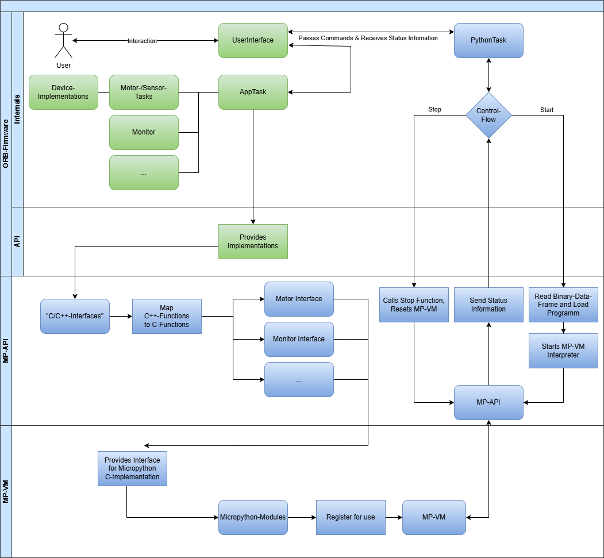

# Inhaltsverzeichnis
- [1. Aufsetzen des GitHub-Projekts](#1-aufsetzen-des-github-projekts)
- [2. Micropython Modul Registrierung](#2-micropython-modul-registrierung)
    - [2.1. Registrieren eines Test-Moduls](#21-registrieren-eines-test-moduls)
    - [2.2. Compilieren und Ausführen einer MPY-Binär-Datei](#22-compilieren-und-ausführen-einer-mpy-binär-datei)
    - [2.3. ORB-Python-Module hinzufügen](#23-orb-python-module-hinzufügen)
    - [2.3.1. Klassen, Objekt und Funktionen ermitteln](#231-klassen-objekt-und-funktionen-ermitteln)
    - [2.3.2. Aufbauen der Module](#232-aufbauen-der-module)
    - [2.3.3. Code::Blocks und Mockups](#233-codeblocks-und-mockups)
- [3. Erstellen der Sphinx-Dokumentation](#3-erstellen-der-sphinx-dokumentation)
    - [3.1. Aufsetzen der Sphinx-Dokumentation](#31-aufsetzen-der-sphinx-dokumentation)
    - [3.2. Umfang der Dokumentation](#32-umfang-der-dokumentation)
- [4. Erster Entwurf der Micropython VM-Schnittstelle](#4-erster-entwurf-der-micropython-vm-schnittstelle)
    - [4.1. Ausführung der VM in einem Thread](#41-ausführung-der-vm-in-einem-thread)
    - [4.2. Micropython-Ausführung unterbrechen](#42-micropython-ausführung-unterbrechen)
- [5. User Program Compile-Script](#5-user-program-compile-script) 
- [x. Firmware-Architektur](#firmware-architektur)

## 1. Aufsetzen des GitHub-Projekts

1. **Repository erstellen**:  
    Zunächst habe ich ein neues Repository auf GitHub angelegt. Zusätzlich habe ich eine `README.md` erstellt.   
    Diese soll anweisungen zu der Verwendug bzw. Einrichtung dieses Projektes enthalten und im Laufe des Projektes erweitert werden. 

2. **Fork des MicroPython-Projekts erstellen**:  
    Der erste Schritt meines Projektes war es einen Fork des Micropython-Projektes zu erstellen.  
    Durch diesen Schritt ist einfach nachvollziehbar, an welchen stellen ich änderungen im Micropython-Projekt vorgenommen habe.
    > [!NOTE]  
    > Der Embed-Port meines Projektes wird gegen den Embed-Port im Micropython-Projekt gebaut. D.h. änderungen an dem Code von Micropython wie z.b. änderungen an der `VM.c` (wie z.B. [Micropython-Ausführung unterbrechen](#micropython-ausführung-unterbrechen)) werden in diesem Fork gemacht.

3. **MicroPython als Submodul hinzufügen**:
   Dadurch das ich ein Fork des Micropython-Projektes erstellt habe, konnte ich dieses als Submodul in mein GitHub-Projekt integriert. Dazu habe ich folgenden Befehl ausgeführt:
    ```bash
    git submodule add https://github.com/NiHoffmann/micropython micropython
    ```
    Durch Diesen Schritt sind änderungen die ich im Micropython-Projekt mache klar von dem Rest der Entwiclung getrennt. Dies möchte ich für alle Komponenten ORB-Firmware, etc. meines Projektes machen.

4. **MicroPython-Projekt einrichten**:  
    - Anschließend habe ich den `mpy-cross`-Compiler gebaut. Dieser wird verwendet um Python-Programme zu MPY-Byte-Code zu compilieren. Das Daten-Format welches von der Micropython-VM gelesen und verarbeitet werden kann.
    - Im gegensatz zu anderen Micropython-Port hat der Embed-Port keine externen abhängigkeiten. Daher muss hier nicht weiter eingerichtet werden.

5. **Erste Projektkonfiguration mit MicroPython Embed**:    
    Für die Initialisierung des Projekts habe ich zwei Dateien aus dem MicroPython-Embed-Projekt verwendet:
    - [`micropython_embed.mk`](): Diese Datei enthält die Make-Regeln für den Embed-Port.
    - [`mpconfigport.h`](): Diese Datei enthält die Konfiguration der Micropython-Ports mehr dazu unter [Micropython-Flags]().
    - Diese Beiden Dateien werden in dem Libs-Ordner meines Projektes abgelegt und verwendet um dem Micropython-Embed-Port zu bauen.

6. **Änderungen am geforkten MicroPython-Projekt**:   
    - Ich musste Anpassungen an der Datei [`mpconfigport_common.h`]() vornehmen. Diese Datei ist für den Build-Prozess unter Linux vorgesehen und enthält Definitionen aus `alloca.h` für die Speicherzuweisung. Da der äquivalente Windows-Header `malloc.h` fehlt, habe ich eine If/Else-Anweisung hinzugefügt, um dieses Problem zu beheben.

7. **Pfadanpassung in `micropython_embed.mk`**:  
    In der Make-Datei `micropython_embed.mk` habe ich den Pfad für `MICROPYTHON_TOP` zu dem Relativen-Pfad meines Micropython-Projektes angepasst:
    ```makefile
    MICROPYTHON_TOP = ../../micropython
    ```

8. **Kompilieren des MicroPython-Projekts**:  
    Anschließend habe ich das MicroPython-Projekt kompiliert. Dazu habe ich sichergestellt, dass alle notwendigen Werkzeuge wie Make, GCC und Python installiert sind. Die Kompilierung habe ich mit folgendem Befehl gestartet:
    ```bash
    make -f .\micropython_embed.mk
    ```

9. **Einrichten des Code::Blocks-Projekts**:  
    Danach habe ich ein leeres C++-Projekt in Code::Blocks erstellt und eingestellt das dieses den GCC-Compiler verwendet.

10. **`main.c` erstellen und Suchverzeichnisse konfigurieren**:  
    Ich habe eine `main.c`-Datei erstellt und die Suchverzeichnisse für den Compiler so eingerichtet, dass folgende Pfade inkludiert wurden:
    - `src/`
    - `libs/`
    - `libs/micropython_embed`
    - `libs/micropython_embed/port`

11. **Compiler-Flags hinzufügen**:  
Um sicher zu stellen, das Micropython korrekt Compiliert und problemlos ausgeführt werden kann ist es wichtig die richtigen Compiler flags zu setzen. Ich konnte durch das betrachten von verschiedenen Ports die durch das Micropython-Projekt bereit gestellt werden herraus finden das Folgende Flags als sicher betrachtet werden können.  Die `-Og` und `-Os` Flags werden für Micropython-Ports verwendet. An sonsten sehe ich das Compilieren mit `-O0` also das optimierungs freie compilieren als unproblematisch. Jedoch hier hier bei ein unter Windows auftretender Bug zu brachten, siehe [Windows-Bug: Falsches Register bei Non-Local Return-Adressierung](Konzepte.md#windows-bug-falsches-register-bei-non-local-return-adressierung). An dieser Stelle sind kompatibilitäts überlegungen der Compiler Flags unter berücksichtigung der ORB-Firmware zu machen. Im Konzept unter [Compiler Flag Kompatibilität](Konzepte.md#compiler-flag-kompatibilität) ist genauer erklärung warum ich es als notwenig ansehe nur diese Flags zu verwenden falls Optimierung von nöten ist.
      
12. **Code:Blocks Build Targets anpassen**: Zu diesem Zeitpunkt war der Build Prozess des Code:Blocks Projektes von dem des MP-Embed-Port los gelöst. Im bestenfall sollte aus der Code:Blocks umgebung auch der MP-Embed-Port gebaut werden können. Zu diesem Zweck habe ich im Code::Blocks Projekt 2 Build-Target angeleget : *Build* und *Rebuild* während build der vorher configurierte Prozess ist, ist rebuild erweitert durch einen Pre-Build-Step. Das *Rebuild*-Build-Target ruft ein batch script auf welches die commandos für das `clear` und `build` des Micropython-Embed-ports enhält. Die Verwendung der Target ist wie Folgt gedacht, entwickelt man nur in der Code:Blocks umgebung ohne neue Module/Funktionen hinzuzfügen so reicht das Build-Target aus. Da die MP-Embed-Port ressourcen nicht immer neu generiert werden müssen. Kommen nun neue Module hinzu, werden alte Umbenannt oder neue Funktionen eingeführt. So kann man einmal das Rebuild-Target ausführen. Danach verwendet man wieder wie gewohn Build.

## 2. Micropython Modul Registrierung

### 2.1. Registrieren eines Test-Moduls
Alle aller erstes Modul habe ich ein Test-Modul umgesetzt. Dies war eine direkte Kopie `examplemodule.c` das ich nicht weiter konfiguriert habe. 

Um dieses mit meinem Embed-Port verwenden zu können, habe ich in meinem `src`-Directory einen Modul-Ordner erstellt. 
Ich musste in dem Micropython-Embed-Makefile (`micropython-embed.mk`)
die `USER_C_MODULES` Variable um den Pfad zu meinem Modul ordner erweitern. 
Außerdem habe ich bei diesem Schritt direkt die C-Flag um die Includ-Directive `-I` für den Modul-Ordern erweitert.  
Die Include-Pfäde für Module sollen immer Relativ zu diesem Ordner gesetzt sein. 

Ich konnte das durch Micropython bereit gestellte Beispiel-Modul problemlos einbinden und vallidieren das ich mein Projekt an dieser Stelle korrekt Konfiguriert hatte. 

An dieser Stelle habe ich jedoch noch den Klar-Text-Interpreter der für den Micropython-Embed-Port vorkonfiguriert ist verwendet.

### 2.2. Compilieren und Ausführen einer MPY-Binär-Datei
Im nächsten Schritt wollte ich den Byte-Code Interpreter Testen.
Dafür ist es Wichtig das folgende Flags in der `mpconfigport.h` gesetzt sind:
```cpp
#define MICROPY_PERSISTENT_CODE_LOAD            (1)
#define MICROPY_ENABLE_GC                       (1)
#define MICROPY_PY_GC                           (1)
````
Nachdem ich dies Konfiguriert hatte, habe ich mein Code::Blocks-Projekt darum erweitert das die MPY-Datei in einByte-Array geladen werden kann. 

Mit dieser Funktion war des dann möglich auf den Byte-Code-Interpreter zu Testen. Mit dem Aufruf `mpy-cross program.py` lasst sich das Micropython-Program Compilieren und ich kann die program.mpy datei von meinem `Code::Blocks`-Projekt laden lassen. 

## 2.3. ORB-Python-Module hinzufügen

### 2.3.1. Klassen, Objekt und Funktionen ermitteln
Der erste Schritt meine Implementierung war es mir zu überlegen welche Module ich umsetzen möchte. Wie meinen Anforderungen zu entnehmen ist, möchste ich alle funktionen der `orblocal.h` in Micropython Abbilden. Dazu gehört es nicht nur die Funktionen Abzubilden, sondern mir auch zu überlegen wie ich die Funktionen am besten in die "Python-Welt" übertragen kann.   
  
Ich sehe es als Sinnvoll an z.b. Motor Funktionen in eine Motor-Klasse zu bündeln. Geräte welche an das ORB angeschlossen werden können sind in dem Modul Devices zusammen gefasst. Alle anderen Funktionen sind in einem Gesonderten Modul wie z.b. die `wait()`-Funktion des `time`-Moduls.   
  
Die genaue Strukturierung ist der [Python-Api: "sphinx-python-api.pdf"](sphinx-python-api.pdf) zu entnehmen. Ursprünglich hatte ich den Plan mit mehr Name-Spaces zu arbeiten bzw. allen Modulen einen `orb.` prefix zu geben, um klar zu machen das es sich hier um die ORB-Implementationen handelt.  
Davon musste ich jedoch absehen: siehe  [Problematik bei der Verwendung von Namespaces](Konzepte.md#problematik-bei-der-verwendung-von-namespaces).

### 2.3.2 Aufbauen der Module
In diesem Schritt musste ich die Module, Klassen, Objekte und Funktionen meines Micropython-Port deffinieren. Abgeleitet werden diese wie bereits beschrieben als der `orblocal.h`.
Der Modul Deisgn-Flow für Micropython Module hatte für mich ein klares vorgehen das in dem Folgenden Diagramm beschrieben ist.  
      
Im wesentlichen musst ich hier Dictionaries für Module, Objekte, Konstanten und Funktionen anlegen. Diese werden verwendet zum C-Funktionen an ein Micropython-Aufruf zu binden. Die Registrierung dieser Module verwendet für die Namen der Aufrufe QStrings, durch die Natur dieser musste nach dem Erstellen oder umgennen von Modulen oder Funktionen der Micropython-Embed-Port neugebaut werden. Also im wesentlich wird hier das C-Bindeglied zu dem Micropython-Interpreter erstellt. Auch die Micropython C-Interface-Klassen bzw. deren Mockup version wurden in diesem Schritt erstellt. Mehr dazu und der Zweck der Mockup-Klassen im nächsten Kapitel [Code::Blocks und Mockups](#233-codeblocks-und-mockups).
Im Folgenden ein kleineres Beispiel Modul welches das vorgehen bei der Entwicklung eines Micropython-Moduls deutlich machen soll:
Leicht angepasst aus: [https://docs.micropython.org/en/latest/develop/library.html](https://docs.micropython.org/en/latest/develop/library.html)  
```cpp
//include für die Micropython Methoden und Objekt-Deffinitionen
#include "py/builtin.h"
#include "py/runtime.h"

//Erstellen einer C-Funktion, diese wird von dem Micropython Interpreter Später aufgerufen
static mp_obj_t py_subsystem_info(void) {
    //Der Rückgabe wert von Micropython Funktionen ist immer ein Micropython-Objekt
    return MP_OBJ_NEW_SMALL_INT(42);
}
//Mocro um eine Funktion als Micropython-Objekt zu registrieren
MP_DEFINE_CONST_FUN_OBJ_0(subsystem_info_obj, py_subsystem_info);

//Modul Dictionary
static const mp_rom_map_elem_t mp_module_subsystem_globals_table[] = {
    //Name des Moduls
    { MP_ROM_QSTR(MP_QSTR___name__), MP_ROM_QSTR(MP_QSTR_subsystem) },
    //QString mit wert `info` welches an der Funktions aufruf subsystem_info_obj gebunden wird.
    { MP_ROM_QSTR(MP_QSTR_info), MP_ROM_PTR(&subsystem_info_obj) },
};
//Macro um das Dictionary zu Registrieren bzw. zu einem Micropython-Objekt zu konvertieren
static MP_DEFINE_CONST_DICT(mp_module_subsystem_globals, mp_module_subsystem_globals_table);

//Das hier ist unser Micropython-Objekt für das Modul
const mp_obj_module_t mp_module_subsystem = {
    //Wir haben einen Objekt-Typ-Modul
    .base = { &mp_type_module },
    //Hier deffinieren wir den gloabls-table also die öffentlich verfügbaren Funktionen dieses Moduls
    .globals = (mp_obj_dict_t *)&mp_module_subsystem_globals,
};

//Hier ist die Tatsächliche Registrierung des Moduls, dieser Aufruf fügt das Modul in die Micropython-Modul/Funktions Tabelle ein
MP_REGISTER_MODULE(MP_QSTR_subsystem, mp_module_subsystem);

```
Wie genau Module aufgebaut werden und die Registrierung aussieht ist aus dem Konzept zu entnehmen. Unter dem Kapitel [Micropython-Types](Konzepte.md/#micropython-types) findet sich ein guter Einstiegs Punkt, um diesen Prozess besser zu verstehen. Es finden sich noch Weitere Kapitel welche das Interne vorgehen des Micropython-Interpreters erläutern und genauer auf die Bausteine der Implementierung eingehen. Diese sind weitesgehend innerhalb dieses Kapitels verlinkt.

### 2.3.3. Code::Blocks und Mockups

Wie in [Warum den MicroPython Embed Port verwenden?](#warum-den-micropython-embed-port-verwenden) bereits beschrieben, soll der MicroPython Embed Port ohne die direkte Einbindung der ORB-Firmware kompiliert werden können. Zu diesem Zweck werden sogenannte "Mockups" eingeführt. Diese Mockups sind C-Dateien, die die C-Interface-Methoden der ORB-Firmware simulieren (welche ich später selbst in das ORB-Firmware-Projekt einfügen werde).

Das bedeutet, dass Mockups die gleichen Enums, Funktionen und Variablen enthalten, die später von der ORB-Firmware benötigt werden, um die Funktionalitäten für die MicroPython-Umgebung bereitzustellen. Sie bieten jedoch selbst keine vollständige Implementierung dieser Funktionen an. Ein Beispiel könnte folgendermaßen aussehen:

Es gibt eine Motor-Mockup-Datei mit der folgenden Funktion:

```cpp
void setMotor(uint8_t port, uint8_t mode, int16_t speed, int pos) {
    printf("set motor port(%u) mode(%u) speed(%d) pos(%d)\n", port, mode, speed, pos);
}
```

Das Motor-Modul kann dann diese Mockup-Funktion verwenden:
```cpp
static mp_obj_t set(size_t n_args, const mp_obj_t *pos_args, mp_map_t *kw_args) {
    enum { ARG_mode, ARG_speed, ARG_position };

    static const mp_arg_t allowed_args[] = {
        { MP_QSTR_mode, MP_ARG_REQUIRED | MP_ARG_KW_ONLY | MP_ARG_INT, {.u_int = 0 } },
        { MP_QSTR_speed, MP_ARG_KW_ONLY | MP_ARG_INT, {.u_int = 0 } },
        { MP_QSTR_position, MP_ARG_KW_ONLY | MP_ARG_INT, {.u_int = 0 } },
    };

    mp_arg_val_t args[MP_ARRAY_SIZE(allowed_args)];
    mp_arg_parse_all(n_args - 1, pos_args + 1, kw_args, MP_ARRAY_SIZE(allowed_args), allowed_args, args);

    motor_obj_t *self = MP_OBJ_TO_PTR(pos_args[0]);

    //use the mockup funktion 
    setMotor(self->port, args[ARG_mode].u_int, args[ARG_speed].u_int * self->direction, args[ARG_position].u_int * self->direction);


    return MP_OBJ_FROM_PTR(self);
}
static MP_DEFINE_CONST_FUN_OBJ_KW(set_obj, 1, set);
```

Im Gegensatz dazu wird die ORB-Firmware anstelle der Mockup-Datei eine andere Motor-Implementations-Datei einbinden. Diese setzt die tatsächliche Funktionalität um bzw. bietet ein C-Interface für die C++ Funktionen der ORB-Firmware.

## 3. Erstellen der Sphinx-Dokumentation

### 3.1. Aufsetzen der Sphinx-Dokumentation

### 3.2. Umfang der Dokumentation 
//installation  
//erstellen der .rst dateien  
//verwenden von python platzhalter dateien welche die Micropython-Module abbilden
//problem mit der pip installation vllt auch & lösung

## 4. Erster Entwurf der Micropython VM-Schnittstelle

>Hier kurz erklärten welche Funktionen umgesetzt werden sollen
auslagern der loadProgram / getProgramLength Funktion
entscheidung erkären, darauf verweisen das im zuge dieser entscheidung im anschluss das compule script entstanden ist

erklären was wir brauchen Start/Stop/isRunning

### 4.1. Ausführung der VM in einem Thread
>Hier kurz erkären wofür des außführen in thead
darauf verweisen, die vm soll später in einer task ausgeführt werden.
Die oben gennanten Funktionen lassen sich nur so sinnvoll testen.

### 4.2. Micropython-Ausführung unterbrechen

Für das Anbinden des Python-VM muss es eine möglichkeit geben dies VM-Ausführung durch die ORB-Firmware zu unterbrechen.  
Betrachtung der bereits bestehenden Systeme wie das Microbit haben folgende erkenntnis gebracht. Bereits bestehende Systeme setzen einfach den gesamten Mikrocontroller zurück. Dies ist für einen Microcontroller, der nur Microypthon ausführt eine gut lösung. Für unseren Anwedungsfalls jedoch eher eine unpassende Lösung.  

Microbit:
```cpp
static mp_obj_t microbit_reset_(void) {
    NVIC_SystemReset();
    return mp_const_none;
}
MP_DEFINE_CONST_FUN_OBJ_0(microbit_reset_obj, microbit_reset_);
```
oder auch Zephyr:  
```cpp
static mp_obj_t machine_reset(void) {
    sys_reboot(SYS_REBOOT_COLD);
    // Won't get here, Zephyr has infiniloop on its side
    return mp_const_none;
}
MP_DEFINE_CONST_FUN_OBJ_0(machine_reset_obj, machine_reset);
```
Da der Embed-Port für diese Micropython-Implementierung eine separate Task sein sollte und nicht den gesamten Controller bei einem Programm-Reset zurücksetzen sollte, müssen wir hier eine eigene Lösung finden.  

Meine Beobachtung wurde bestätigt, als ich durch die Micropython-Community-Chats schaute: „You can reset the processor from within an ISR using pyd.hard_reset() or machine.reset(). Otherwise, you'd need to set a flag and have the main script exit when it detects that flag is set.“ (https://forum.micropython.org/viewtopic.php?t=2521)  
  
Die Lösung hier besteht darin, ein neues Flag einzuführen. Ich habe die Überprüfung meines Flags in die Datei vm.c am Anfang der dispatch_loop aufgenommen. Diese Schleife ist die Logik, die bestimmt, wie eine Zeile Code verarbeitet werden soll.  

Da Micropython nicht threadsicher ist, sind einige wichtige Überlegungen zu beachten: Ich sollte nur innerhalb der VM, in den von der VM verwendeten Speicher schreiben. Daher habe ich die gesamte Logik zur Erstellung und Injection meiner Exceptuon an den Anfang der dispatch_loop verschoben , diese erkennt das eine Exception geplant ist und handbat sie dann im folgenden.  
(vm.c Zeile: 309).  
```cpp
<...>
dispatch_loop:
       //This is the Main Logic, orb_interrupt will only ever be written from outside mp
       //so this flag is never a race condition
       //inside here we create the exception so we never get mem error
       //we have to do this at the top to bypass controll flow
       #ifdef ORB_ENABLE_INTERRUPT
       if(MP_STATE_VM(orb_interrupt)){
           static mp_obj_exception_t system_exit;
           system_exit.base.type = &mp_type_SystemExit;
           //since this is a user interrupt the traceback will be empty
           system_exit.traceback_alloc = 0;
           system_exit.traceback_data = NULL;
   
           //we pass a single argument in our tuple, the error message
           system_exit.args = (mp_obj_tuple_t*) mp_obj_new_tuple(1, NULL);
           mp_obj_t mp_str = mp_obj_new_str("User Interrupt", 14);
           system_exit.args->items[0] = mp_str;
           MP_STATE_THREAD(mp_pending_exception) = &system_exit;
           MP_STATE_VM(orb_interrupt_injected) = true;
       }
       #endif

<...>
```
Von außerhalb der VM muss nun im falle eines Interrupts nur das Flag `orb_interrupt` gesetzt werden. Es ist wichtig zu beachten, dass dieses Flag nicht von innerhalb des Micropython-Projekts beschrieben wird, auch nicht zum Zurücksetzen des Flags.   

Dieser Code plant eine einfache Exception. Der hier Nachteile ist, dass dies (mit einem unveränderten Micropython) von einem Try/Catch-Block erfasst wird.   
  
Somit musste ich noch eine weitere Änderung vornehmen. Daher musste ich den folgenden Teil der VM ändern, um die Try-Catch-Logik zu ignorieren, falls das Interrupt-Flag gesetzt ist   
(vm.c Zeile: 1473).  
```cpp
<...>
if (exc_sp >= exc_stack
    //this part of the code handles try/catch blocks, we dont want them to be treated as such, if orb interrupts treate any error as un-handled
    #ifdef ORB_ENABLE_INTERRUPT
    && !MP_STATE_VM(orb_interrupt_injected)
    #endif
    ) {
    // catch exception and pass to byte code
) {
<...>
```
Nun kann der VM-Interrupt geplant werden. Da die Dispatch-Schleife jedes Mal besucht wird, wenn etwas verarbeitet werden muss, wird dies immer dazu führen, dass die Ausführung nach Abschluss der aktuellen Befehlsverarbeitung unterbrochen wird.  
  
## 5. User Program Compile-Script
//das hier habe ich eigentlich schon fürher   
//ich denke das schiebe ich alles nach hinten da ich hier zum ende hin noch änderungen hatte

   
erstellt wusste nur noch nicht wo genau ich es am besten unterbringe, außedem ergenzung um information der error flag, falls compilierung hier fehlschlägt bricht der build prozess in code blocks ab.

Um den Compile Prozess von Python nach MPY-Byte-Code zu vereinfachen und in Code::Blocks einzugiben, habe ich ein compile script erstellt. Dieses ist in Python geschrieben. 
Diese Compile Script hat Folgende Aufgabe:  
1. Aufrufen des MPY-Cross-Compilers und Compilieren des Codes.  
2. Erfassen der Programm-Länge
3. MPY-Byte-Code und Programm länge in eine Datei schreiben
4. Das Compile script nimmt als kommando zeilen argument den namen/pfad der zu compiliernden Datei 

Ich verwende das Python `tempfile` Modul die micropython datei in ein temporäres verzeichnis zu schreiben und dort den compile prozess durchzuführen. Die daraus entstehende temporäre `.mpy` Datei wird dann wieder ausgelesen und für die weitere verarbeitung verwendet.
Der hintergedanke hierzu ist wie Folgt:  
  
1. Micropython wenn es später auf dem ORB ist, muss über die Information verfügen wie lang das zu ladende Programm ist. Die Programm länge seht immer am Anfang der MPY-Datei. Und auch immer genau die länge 4-Byte. Diese Information wird immer an der selben stelle stehen. Mit dieser Information kann dann später das Programm korrekt geladen werden. 
2. Das Laden eines Neuen Programmes geschieht so in einer Datei.
3. Durch das erstellen der Temporären Ordner, kann das compile script so auch später in das Open Roberta Lab eingebaut bzw. übernommen werden.  

Auch wenn es unter Windows bessere wege gibt als die länge der Programmes immer mit vor die Datei zu schreiben, so sehe ich es doch als eine möglichkeit dieses Prinzip hier auszuprobieren. Da es sich als eine Sinnvolle Lösung für eine Später auftretendes Problem anbietet. 

> [!NOTE]  
>An dieser Stelle währe es auch eine
überlegung wert dem nutzer die 
möglichkeit zu geben in der `.bin` Datei voreingestelle kallibrationen für sensoren miz zu liefen oder allgemein ein nutzdaten feld anzubieten.
Hier könnte man Nutzerdaten aus der Speicherbereich den der Nutzer bereit gestellt bekommt wieder einlesen, dafür müsste man aber auch einen weg haben den speicher des ORB bzw. der Nutzer-Speicher des ORB auszulesen.

## 6. Testen
//habe ich schon gemacht nur noch nicht festgehalten, hier später auf die Tests verweisen bzw. diese in einzelne Dateien auslagern.   
also  MonitorTest,ExceptionTest,.... und auch falls notwendig wie die ORB-Firmware verändert werden muss damit man Testen kann  
(z.B. ausschalten der automatischen gc flag usw.)

## 7. Integration in ORB-Firmware

### 7.1. Entwicklungs Gerüst
Der erste Schritt meiner Entwicklung auf dem STM32-F405-Mikrocontroller bestand darin, das grundlegende Entwicklungsgerüst zu erstellen. Dabei ging es zunächst darum, die grundlegende Funktion des MicroPython-Ports zu testen. An diesem Punkt war es noch nicht entscheidend, Programme zu übertragen oder tatsächliche Funktionen zu nutzen.

Ich habe die MicroPython-VM in das ORB-Firmware-Projekt integriert und leere C-Interfaceklassen für die Firmware erstellt. Der auszuführende Byte-Code wurde dabei als statisches Array in die Firmware integriert und gemeinsam mit ihr übertragen. Mein erstes Test-Programm war ein einfacher Funktions-Aufruf, welcher auf seiten der C-Interfaceklassen eine LED eingeschlatet hat. In diesem Schritt habe ich die eigentliche ORB-Firmware zunächst außen vor gelassen. Das bedeutet, dass ich alle Tasks und zusätzlichen Funktionen, die von der ORB-Firmware realisiert werden, auskommentiert habe. Lediglich die eingebundene EMB-Sys-Lib der ORB-Firmware habe ich verwendet. Um auf die LED-Klassen zugreifen zu können.

Um die Firmware auf den Mikrocontroller zu flashen, habe ich das Tool `dfu-util` verwendet. Hierfür musste ich den Mikrocontroller zunächst in den DFU-Modus versetzen und mithilfe von Zadig als ein WinUSB-Gerät konfigurieren. 

Nachdem ich diese vorbereitenden Schritte abgeschlossen hatte, konnte ich mit der eigentlichen Entwicklung des Embed-Ports beginnen. Und ihn schrittweise in die ORB-Firmware integrieren.

### 7.2. Übertragung des Programmes
Um meine Funktionen testen zu können, war zunächst die Programm-Übertragung auf die ORB-Firmware wichtig. Außerdem musste das Ausführen von Programmen direkt aus dem Flash-Speicher realisiert werden.
 Dies würde die spätere Entwicklungszeit deutlich verkürzen und mir ermöglichen, effizienter zu testen.


Ich habe mich entschieden, Sektor 11 als Speicherort zu wählen. Dieser liegt weit entfernt von allen anderen genutzten Speicherblöcken, einschließlich des Firmware-Codes. 

Sektor 11 befindet sich an der Adresse 0x080E0000. dfu-util kann Byte-Daten an definierte Stellen schreiben. Die MPY-Binär-Datei kann mit dem dem Folgenden Befehl übertragen werden: 
```
dfu-util -a address_offset --dfuse-address 0x080E0000 -D <bin_pfad>
```
Die MPY-Binärdatei hat folgende Struktur: `<4byte_länge><xxbyte_ mpy-bytes>`. Im Späteren verlauf wurde dieser Daten-Frame erweitert siehe [link zu python/cpp flag]().

Die Länge muss zusätzlich übertragen werden, um zu bestimmen, wie viele Bytes aus dem Flash-Speicher geladen werden müssen. Diese Längenangabe liegt an einer vordefinierten Speicheradresse (0x080E0000 - 0x080E0003). Die Kodierung dieses 32-Bit-Wertes erfolgt im Big-Endian-Format.

### 7.3. Umsetzen der Tatsächlichen Modul Funktionen
> verbinden mit durch AppTask bereit gestellten funktionen also die orblocal.h funktionen wie vorgegeben durch die Anforderugen
 
> memeory klasse ausversehen firmware-code überschrieben, save/unsave mode vielleicht einführen oder zumindest kurz erwähnen das dies möglich ist  
-> gedankt nutzer speicher bereich einschränken

bis jetzt nur mit Motoren/Speicher getestet da ich sonst keine EV3-Teile habe  

### 7.4. Einbinden in die Python-Task & Verbinden mit USB-Task
> Erster schritt in richtung verwendung von Tasks  
Danach auch umsetzen/anpassen der Monitor funktionen hier erwähnen das print nicht richtig funktioniert hat -> kleine anpassung an ORB-Application  
im späteren verlauf noch überarbeiten

>problem mit monitor klasse wie funktioniert die micropython `print()`-Funktion (in konzepte erstellen)  
darauf verweisen und erkläten wie mit dem problem umgegangen wird bzw. das dieses problem erst einmal nicht gelöst wird  
da monitor.setText als funktion bereit steht  
Hier problem mit print von exceptions weiter erkläten und warum das hier kein problem ist.  

#### 7.4.x Problem der Micropython-Vm (Mem-Fault)
> Registrieren des Fault-Handlers und gedanken dahinter erklären
vllt hier auch auf Konzepte auslagern/verweisen und einfach nur sagen das ich die anbindung gemacht habe. 

#### 7.4.x Zusätzliche Konfigurations-Flags für ease of use  
Z.B. Heap-Size, Enable_Interrupt, Enable_Automatic gc,.....  also quasi alles was in der mphalport erweiter wurde  
gedanken hinter der erweiterung vielleicht kurz erklären  
//Hier könnte man dann auch auf Konzepte verweisen und die Philosophie hinter flags in dem Microypthon-Projekt erklären "Modulatität"  
//->"good practice" solche konzepte mit umzusetzen usw.

### 7.5. Wiederherstellen der ORB-Funktionen
//wieder einbiden der ORB-Tasks, anpassen bzw. zusammen führen der AppTasks und PythonTask in das User-Interface & Umbennennen der Funktionen. Die Python Task soll sich wie die AppTask verhalten im besten fall sollten keine bzw. wenig änderungen an den anderen Klassen dadurch entstehen.

## Firmware-Architektur
> Die Firmware Architektur sieht wie folgt aus,....


//hier warscheinlich noch den text anpassen,.... soll gut lesbar sein
Wie in dem Diagramm zu erkennen ist Teilt sich die Firmware-Archtektur in 3 Hauptteile unter.

1. ORB-Firmware  
    1. API(also ORBLocal bzw. das Interface das ich dann verwende)
    2. Internals
2. MP-API
3. MP-VM

//die überschriften hier sind dann später links zu den kapiteln....
>Hier die dann Einzelteile erklären interaktion zwischen den Einzelteilen
Involvierte klassen und genanken hinter den interfaces, besonders auf Systemgrenzen eingehene und gedanken hinter diesen.
z.b. MP-API hat flags welche nur von außen beschrieben werden, funktionen immer nur inerhalb einer task verwenden, MR-RTOS-Task führt in sich geschlossen die VM aus usw.  
Kurzgesagt einen groben überblick über alle System-Komponenten
